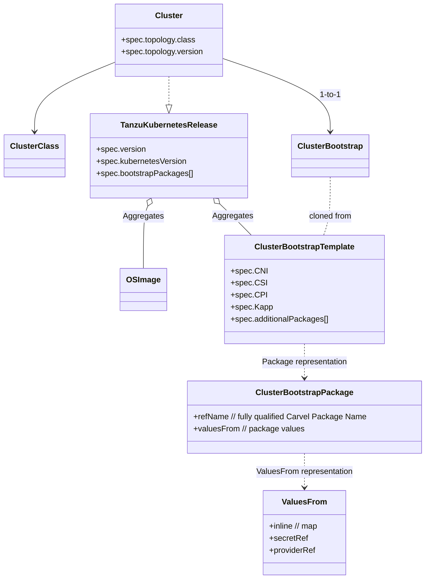
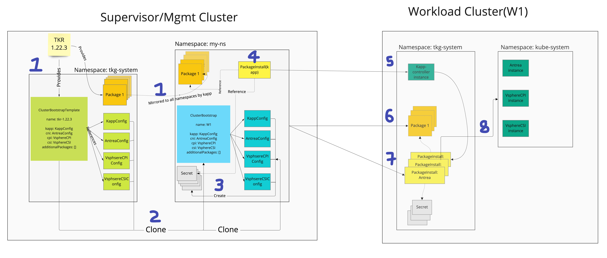
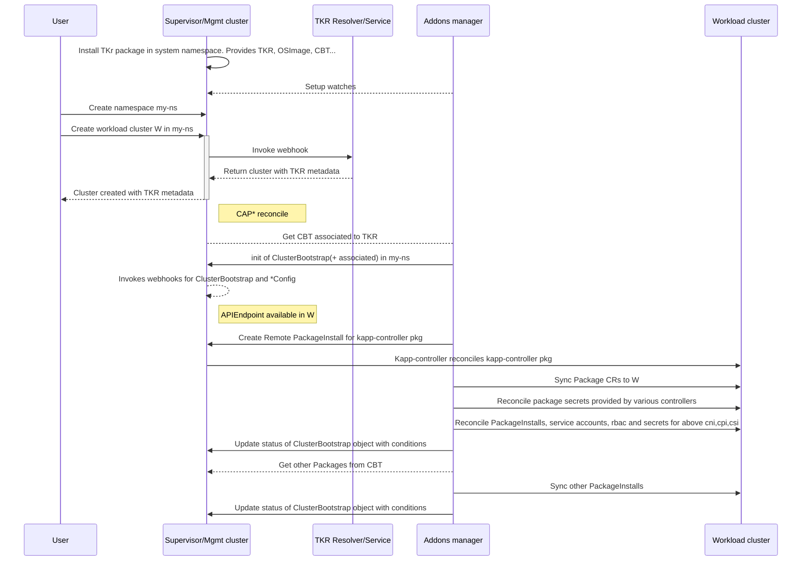
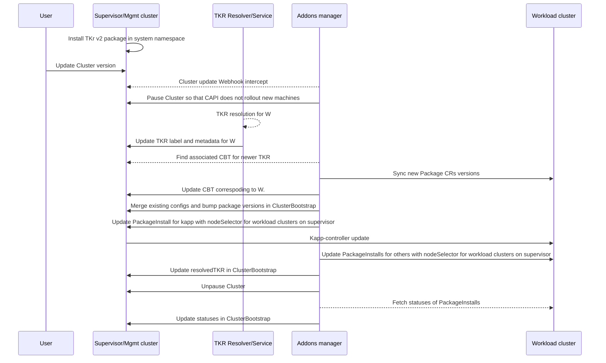
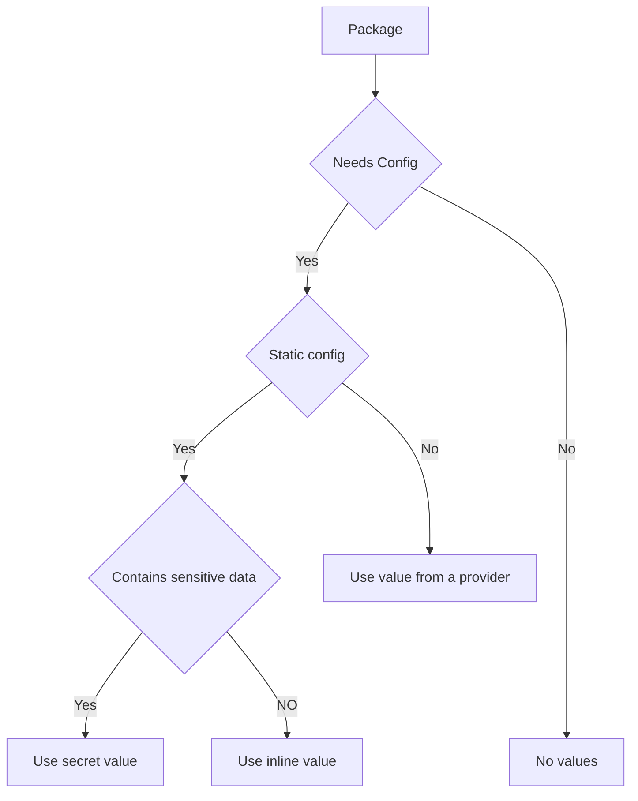

# Tanzu Addons Manager

Tanzu Addons Manager manages the lifecycle of core Carvel packages such as Kapp-controller, CNI, CPI, CSI and a list of arbitrary Carvel Packages.
The mechanism for determining the versions of packages is via an imgpkg bundle(TKr package) that contains a number of resources which are described below.

## APIs

The following are the primary APIs used by the addons manager for determining what packages, versions and configurations go into a kubernetes cluster.

1. **TanzuKubernetesRelease(tkr)** - This is a resource that represents a summary of items contained in a Tanzu Kubernetes release.
It aggregates VM images using OSImages resource, packages and versions shipped with a release. It specifies all the components
that will be automatically life cycled managed.
2. **ClusterBootstrapTemplate(cbt)** - This is a cookie cutter template resource of opinionated Carvel packages and their configurations that will be installed on a cluster.
There is a 1:1 relationship with tkr resource. This establishes a mapping of compatibility between a kubernetes version and a package version.
3. **ClusterBootstrap(cb)** - This is a resource that has 1:1 relationship with a Cluster resource. When a tanzu cluster is created a cbt resource is cloned to create a cb resource.
Once cloned the cb resource has no linkage to a cbt until a new version of tkr is rolled out and the tkr components update the version

The next set of APIs are used to provide values for configuring packages in ClusterBootstrap. Tanzu-framework defines
a set of APIs for core packages, but they can be overridden by an OEM distributor of Tanzu by bringing their own mechanism of
configuring their package. See the provider model below for more information

1. **KappControllerConfig** - This is a resource that represents the configuration of kapp-controller carvel package.
2. **AntreaConfig** - This is a resource that represents the configuration of antrea carvel package.
3. **CalicoConfig** - This is a resource that represents the configuration of calico carvel package.
4. **VSphereCPIConfig** - This is a resource that represents the configuration of vsphere cloud provider carvel package for both paravirtual and non-paravirtual modes of operation.
5. **VSphereCSIConfig** - This is a resource that represnets the configuration of vsphere csi carvel package for both paravirtual and non-paravirtual modes of operation.

## Webhooks

1. A validating webhook for ClusterBootstrapTemplate ensures that
   1. it can only be created in a system namespace
   2. required packages such as kapp and cni are set
   3. only one type of valuesFrom is defined for a package
   4. it is immutable
2. A validating webhook for ClusterBootstrap ensures that
   1. required packages such as kapp and cni are set and valid
   2. any package being set is available in a system namespace(provided by TKR components)
   3. an update does not remove required packages
   4. an update does not downgrade a package version
   5. an update does not delete any package
   6. an update does not change package ref for core packages, for example changing cni from antrea to calico is not allowed
   7. an update does not alter the mechanism used to provide valuesFrom
3. A defaulting webhook for ClusterBootstrap is a convenience to enable API users to provide partial objects with an annotation
to fill missing information from a ClusterBootstrapTemplate. This allows a user to customize packages or a specific package in a cluster.

## Object relationship



## Objects in Supervisor/Management and Workload cluster



1. A TKr package bundle corresponding to a kubernetes version is installed by TKR service on a Supervisor/Management Cluster(SC).
2. The bundle provides a number of resources as TKR, OSImage, CBT and various AddonConfig resources.
3. A Cluster object corresponding to a ClusterClass and a version results in TKR service adding metadata to the Cluster object
to indicate the TKR to use for this cluster.
4. Addons-manager which includes a number of controllers and webhooks will pick the CBT corresponding to the TKR and clone
it to a CB along with all its dependencies into the namespace of Workload Cluster(W1) in SC.
5. Various addon config controllers will create secrets corresponding to configuration required to install packages.
6. After W1 api-server endpoint is available, a PackageInstall is created for kapp-controller in the namespace of the W1 in the SC.
7. kapp-controller on SC will then create kapp-controller on W1.
8. Addons controller will create PackageInstalls for all core packages(excluding kapp) and additional packages on W1.
9. Addons controller will update current status of various packages in W1 back into status of CB in SC located in namespace of W1.

## Sequence of operations

### Create



### Upgrade

An upgrade of all managed packages is triggered when `spec.status.resolvedTKR` in a ClusterBootstrap is different from the
tkr label `run.tanzu.vmware.com/tkr` on a Cluster object.



## Customizing a cluster

In most use cases clusters should be created with just a Cluster object and TKG components will create an opinionated
cluster with packages and configurations. Customizing packages and configurations in a cluster is supported(see below). OEM distributors of TKG should
create their own TKr package that conforms to their majority use cases so that end users need not go down the path of customizing.

### Options for customizing

#### Pre-create specific *Config CR

Example Use case: Customize MTU for antrea
Solution: Create custom AntreaConfig with same name format as {CLUSTER_NAME}-{package-short-name}-package in the namespace as the Cluster object.
Ordering the resources is enforced by tools such as kubectl or tanzu CLI.

Explanation: The controllers will attempt to create a config with above name in the namespace of the cluster. If one already exists then only the
owner references of the existing resource are updated.

```yaml
apiVersion: cni.tanzu.vmware.com/v1alpha1
kind: AntreaConfig
metadata:
  name: {CLUSTER_NAME}-antrea-package
  namespace: my-ns
spec:
  antrea:
    config:
       defaultMTU: 9000
---
apiVersion: cluster.x-k8s.io/v1beta1
kind: Cluster
metadata:
   name: my-cluster
   namespace: my-ns
spec:
   infrastructureRef:
      kind: VSphereCluster
   clusterNetwork:
      pods:
         cidrBlocks: [ "192.168.0.0/16","fd00:100:96::/48" ]
      services:
         cidrBlocks: [ "192.168.0.0/16","fd00:100:96::/48" ]
...
...
```

When the config resource is pre-created, addons-controller will use it in lieu of the one provided by CBT.

#### Pre-create ClusterBootstrap resource

If the use case is to swap out a specific package, for example CNI with your own package then create the ClusterBootstrap object in its entirety
with the same name as the Cluster resource. Creating this resouce in its entirety can put additional burden on clients so a defaulting webhook is
provided.

```yaml
apiVersion: run.tanzu.vmware.com/v1alpha3
kind: ClusterBootstrap
metadata:
   name: my-cluster
   namespace: my-ns
spec:
   kapp:
      refName: kapp-controller.tanzu.vmware.com.0.30.3
      valuesFrom:
         providerRef:
            apiGroup: run.tanzu.vmware.com
            kind: KappControllerConfig
            name: test-cluster-tcbt-2-kapp-controller-config
   additionalPackages:
      - refName: foobar1.example.com.1.17.2
        valuesFrom:
           secretRef: foobar2secret
   cni:
      refName: antrea.tanzu.vmware.com.1.2.3--vmware.1-tkg.1
      valuesFrom:
         providerRef:
            apiGroup: cni.tanzu.vmware.com
            kind: AntreaConfig
            name: test-cluster-tcbt-2
---
apiVersion: cluster.x-k8s.io/v1beta1
kind: Cluster
metadata:
   name: my-cluster
   namespace: my-ns
spec:
   infrastructureRef:
      kind: VSphereCluster
   clusterNetwork:
      pods:
         cidrBlocks: [ "192.168.0.0/16","fd00:100:96::/48" ]
      services:
         cidrBlocks: [ "192.168.0.0/16","fd00:100:96::/48" ]
...
...
```

#### Day 2 customization

A package and its configuration can be modified post cluster creation by updating associated Config. It will be retained
post cluster upgrade. Note that package versions are tightly controlled by the TKR, if the version is bumped then it will
be reset on a cluster upgrade.

#### Defaulting webhook for ClusterBootstrap

A defaulting webhook for ClusterBootstrap allows a client to provide partial information and the webhook will fill out
rest of the information. The webhook will default whenever it sees an annotation that matches a TKR. The annotation is
of the format `tkg.tanzu.vmware.com/add-missing-fields-from-tkr:v1.22.4`.

Additionally a client can provide a wildcard for a package `refName` and the webhook will find the appropriate version based
on the TKR

```yaml
apiVersion: run.tanzu.vmware.com/v1alpha3
kind: ClusterBootstrap
metadata:
   name: my-cluster
   namespace: my-ns
   annotations:
      tkg.tanzu.vmware.com/add-missing-fields-from-tkr: v1.22.4
spec:
   cni:
      refName: calico*
      valuesFrom:
         providerRef:
            apiGroup: cni.tanzu.vmware.com
            kind: CalicoConfig
            name: sample-config
```

#### Create fully custom ClusterBootstrap and Config custom resources

There might be cases where the user wants to create custom Config and ClusterBootstrap resources on their entirety. The user might choose to
create these custom resources prior to or after the creation of the cluster object. In such cases, the user needs to add the annotation of the
format `tkg.tanzu.vmware.com/custom-clusterbootstrap : ""` to the Cluster resource. When this annotation exists on the Cluster object, the
ClusterBootstrap resource will not get cloned from the ClusterBootstrapTemplate anymore.

## Provider values to a Package

Configuration for a package can be provided using one of three approaches. By definition providerRef and secretRef cannot cross namespace boundary.

```yaml
...
refName: mypackage.acme.com.1.23
valuesFrom:
   providerRef:
      apiGroup: acme.com
      kind: AcmeConfig
      name: sample-config
---
refName: mypackage.acme.com.1.23
valuesFrom:
   secretRef: my-secret-key
---
refName: mypackage.acme.com.1.23
valuesFrom:
   inline:
      key1: value1
      nested_key:
         key2: value2
```

### ProviderRef

A ProviderRef allows you to define a strong API type that is versioned via a CustomResourceDefinition. ClusterBootstrap
consumes the `providerRef` by specifying `apiGroup`, `kind` and `name`. Resource version is inferred from the api server by
querying for `ServerPreferredResources`.

The contract for providerRef is to ensure that a secret name is provided by a reconciling controller in `.status.secretRef`.

Example provider

```yaml
apiVersion: cni.tanzu.vmware.com/v1alpha1
kind: AntreaConfig
metadata:
   name: my-cni
   namespace: my-ns
spec:
   antrea:
      config:
         trafficEncapMode: "encap"
         noSNAT: false
         tlsCipherSuites: TLS_ECDHE_ECDSA_WITH_AES_128_GCM_SHA256,TLS_ECDHE_RSA_WITH_AES_128_GCM_SHA256,TLS_ECDHE_RSA_WITH_AES_256_GCM_SHA384,TLS_ECDHE_ECDSA_WITH_AES_256_GCM_SHA384,TLS_RSA_WITH_AES_256_GCM_SHA384
         disableUdpTunnelOffload: false
         featureGates:
            AntreaProxy: true
            EndpointSlice: true
            AntreaPolicy: true
            NodePortLocal: false
            AntreaTraceflow: true
            Egress: false
            FlowExporter: false
```

A controller that is reconciling this provider should write the desired configuration to status

```yaml
apiVersion: cni.tanzu.vmware.com/v1alpha1
kind: AntreaConfig
metadata:
   name: my-cni
   namespace: my-ns
spec:
...
...
status:
  secretRef: my-cni-config
---
apiVersion: v1
kind: Secret
metadata:
   name: my-cni-config
   namespace: my-ns
data:
...
...
```

## How to bring your own package as a managed addon

1. Create or use an existing carvel package. The Package CR must be added to a cluster

```yaml
apiVersion: data.packaging.carvel.dev/v1alpha1
kind: Package
metadata:
  name: calico.tanzu.vmware.com.3.19.1--vmware.1-tkg.1
  namespace: cluster-namespace-2
spec:
  refName: calico.tanzu.vmware.com
  version: 3.19.1+vmware.1-tkg.1
  releaseNotes: calico 3.19.1 https://docs.projectcalico.org/archive/v3.19/release-notes/
  licenses:
    - 'VMware’s End User License Agreement (Underlying OSS license: Apache License 2.0)'
  template:
    spec:
      fetch:
        - imgpkgBundle:
            image: projects-stg.registry.vmware.com/tkg/tkgextensions-dev/packages/core/calico:v3.19.1_vmware.1-tkg.1
      template:
        - ytt:
            paths:
              - config/
            ignoreUnknownComments: true
        - kbld:
            paths:
              - '-'
              - .imgpkg/images.yml
      deploy:
        - kapp:
            rawOptions:
              - --wait-timeout=30s
              - --kube-api-qps=20
              - --kube-api-burst=30
  releasedAt: "2021-12-20T10:59:32Z"
  valuesSchema:
    openAPIv3:
      title: calico.tanzu.vmware.com.3.19.1+vmware.1-tkg.1 values schema
```

1. Decide how to plumb data values to the package if any.



1. If using a provider, create an API + Controller. It is not necessary that the API and controller live in tanzu-framework.
As long as the API satisfies the contract(see above), the controller code and CRD can live anywhere. See the following for
examples.


