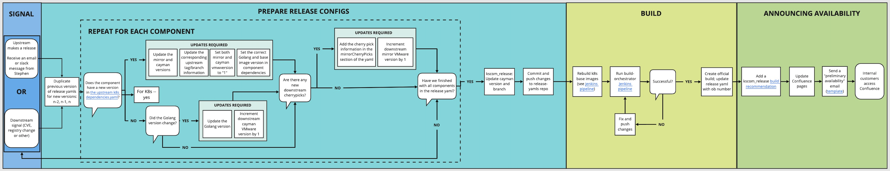

## Table of Contents
   * [1. Signal](TKG-Core-release-process.md#1-signal)
   * [2. Prepare Release Configs](TKG-Core-release-process.md#2prepare-release-configs)
   * [3. Build](TKG-Core-release-process.md#3-build)
   * [4. Announcing Availability](TKG-Core-release-process.md#4announcing-availability)

# 1. SIGNAL

We want to automate this step in the near future. For now, here are the manual steps we take.

## 1.1 Either: [Upstream makes a release](#upstream-makes-a-release), or [there’s a downstream signal](#new-vmware-minor-version-of-an-existing-downstream-signal-due-to-a-cve-registry-change-or-other-critical-change) (CVE, registry change or others)

### Upstream makes a release

Kubernetes is currently offering support for the [last three versions](https://github.com/kubernetes/sig-release/blob/master/releases/patch-releases.md), which we support concurrently. As of November 2020 these versions are 1.17, 1.18 and 1.19. 

When there’s a new patch release, you must go through the process below three times—once for every new minor version. 

#### Patch release communications

**Externally**, an announcement about patch releases going live is sent via these Kubernetes community mailing lists: kubernetes-announce <[kubernetes-announce@googlegroups.com](mailto:kubernetes-announce@googlegroups.com)> and kubernetes-dev <[kubernetes-dev@googlegroups.com](mailto:kubernetes-dev@googlegroups.com)>. Please subscribe to these.

**Internally**, someone (usually Stephen Augustus) posts an announcement to the #tkg-devel and #k8s-upstream Slack channels.
* In the future we wish to automate this step.
* TKGS has a Concourse job that monitors K8s releases all the time, and when one shows up independent of the email, and when there’s a one-day lag, the system starts itself up.

### New VMware minor version of an existing downstream signal due to a CVE, registry change, or other critical change

In either case, we move on to the next stage of the process.

# 2. PREPARE RELEASE CONFIGS

Here's where we update the component configs for new changes.

## 2.1 Duplicate previous version of release yamls for new versions: n-2, n-1, n

When you’re making a new patch, name the new release yaml file with format `release-<major>.<minor>.<patch>+vmware.1.yaml`.

## 2.2 Repeat for each component

You must go through this process for each of these **SIX** components (links direct you to an example for TKG Core v1.19.4):
* [Kubernetes](https://github.com/kubernetes/kubernetes/blob/v1.19.4/build/dependencies.yaml) to v1.19.4 example)
* [CNI Plugins](https://github.com/kubernetes/kubernetes/blob/v1.19.4/build/dependencies.yaml#L28-L38)
* [CoreDNS](https://github.com/kubernetes/kubernetes/blob/v1.19.4/build/dependencies.yaml#L51-L55)
    * There are two version of CoreDNS. We care about `kubeadm`, not `kube-up`
* [CRI Tools](https://github.com/kubernetes/kubernetes/blob/v1.19.4/build/dependencies.yaml#L57-L66)
* [Etcd](https://github.com/kubernetes/kubernetes/blob/v1.19.4/build/dependencies.yaml#L76-L91)
    * We only care about etcd, not etcd-image
* Kscom_release
    * This is an internal component, which we deal with at the same time as the above external components.

Containerd is a component we use that is not in upstream K8s, so we don’t need to make any updates.

## 2.3 Does the component have a new version in the upstream Kubernetes dependencies.yaml? ([Yes](#yes-it-has-a-new-version-updates-required)/[No](#no-it-doesnt-have-a-new-version-did-the-golang-version-change-yesno))

* For each component listed in [2.2](#repeat-for-each-component), compare their dependencies.yaml version numbers with those in our duplicated release yamls. If the version on dependencies.yaml is different than our release yaml, we will need to update our release yaml.

### YES, it has a new version: Updates required

This is another for loop that you must follow when updating all three K8s versions. Bulleted items denote the fields in the release yamls to update. 

#### 1. Update the mirror and cayman versions.

Here we'll use examples taken from the 1.19.4+vmware.2 TKG Core release, for `cni-plugins`.
* `mirrorVersion` ([example](https://gitlab.eng.vmware.com/TKG/release-yamls/-/blob/master/release/release-1.19.4+vmware.2.yaml#L36) ) 
* `caymanDstVersion` ([example](https://gitlab.eng.vmware.com/TKG/release-yamls/-/blob/master/release/release-1.19.4+vmware.2.yaml#L43)): the branch name is derived from this
* `caymanDstBranch` ([example](https://gitlab.eng.vmware.com/TKG/release-yamls/-/blob/master/release/release-1.19.4+vmware.2.yaml#L46)): needs to match caymanDstVersion

#### 2. Update the corresponding upstream tag/branch information.

Continuing with our example for `cni-plugins`:

`upstreamTag` ([example](https://gitlab.eng.vmware.com/TKG/release-yamls/-/blob/master/release/release-1.19.4+vmware.2.yaml#L35)): update the Kubernetes version.

#### 3. Set both mirror and cayman vmwversion to `1`.

Again, using `cni_plugins`: 

* `mirrorVmwVersion` ([example](https://gitlab.eng.vmware.com/TKG/release-yamls/-/blob/master/release/release-1.19.4+vmware.2.yaml#L37))
* `caymanDstVmwVersion` ([example](https://gitlab.eng.vmware.com/TKG/release-yamls/-/blob/master/release/release-1.19.4+vmware.2.yaml#L4))

#### 4. Set the correct Golang and base image version in component dependencies

You’ll find version information in the upstream dependencies.yaml.

Components/Fields:
* `golangVersion`: This field exists for each component, and must be updated.
* `caymanDependency` ([example](https://gitlab.eng.vmware.com/TKG/release-yamls/-/blob/master/release/release-1.19.4+vmware.2.yaml#L92)): update the Golang version here.
* Some components will have additional dependency info in the `addtlPair` field in the release yaml. For example, some components (like the Kubernetes and etcd components) have a dependency on specific Kubernetes base images:
    * Update the version info in the `addtlPair` section to match dependencies.yaml
    * `debian_base_image=debian-base-amd64:<version>` ([location in dependencies.yaml](https://github.com/kubernetes/kubernetes/blob/v1.19.4/build/dependencies.yaml#L121))
    * `debian_iptable_image=debian-iptables-amd64:<version>` ([location in dependencies.yaml](https://github.com/kubernetes/kubernetes/blob/v1.19.4/build/dependencies.yaml#L137))
    * `pause=<version>` ([location in dependencies.yaml](https://github.com/kubernetes/kubernetes/blob/v1.19.4/build/dependencies.yaml#L161))
        * `pause: dependents` is the actual version of the output artefact/pause image. This is the version of the final image itself we use. 
        * Note: The contents of this image are often updated without the version image being updated. Therefore, out of caution we rebuild the pause image downstream.  

Once you’re finished with these required updates, move on to addressing new downstream cherrypicks.

### NO, it doesn't have a new version: Did the Golang version change? ([Yes](#yes-the-golang-version-changed-updates-required)/[No](#no-the-golang-version-did-not-change-move-on-to-addressing-new-downstream-cherrypicks))

#### YES, the Golang version changed: Updates required

1. Update the Golang version

2. Increment the downstream cayman VMware version by 1

#### NO, the Golang version did not change: Move on to addressing new downstream cherrypicks (*THIS SECTION NEEDS MORE INFO*)

*This just currently lists out what to do after a cherrypick has been created and we already have the information (commit sha and description).*

## 2.4 Are there any new downstream cherrypicks? ([Yes](#yes-there-are-new-downstream-cherrypicks-updates-required)/[No](#no-there-are-no-new-downstream-cherrypicks-see-next-step))

A downstream cherrypick is used to apply a change onto the downstream mirror repo of a component. We use cherrypicks as a way to apply hotfixes when we can not wait for a change to happen upstream.

To create a cherry pick commit:
1. Create a branch off of the downstream mirror repo and name it something like `<old-branch-name>-cherrypick`
1. Create a commit on this branch with the desired changes/fixes.
1. Make note of the commit sha

### YES, there are new downstream cherrypicks: Updates required

#### 1. Add the cherrypick information in the mirrorCherryPicks section of the yaml
* The two items needed in a mirrorCherryPick are the commit sha and a description
```aidl
- sha: <commit sha of cherrypick>
  description: <description of what cherrypick does>
```

#### 2. Increment the downstream mirror VMware version by 1

When you’re finished, go to this step.

### NO, there are no new downstream cherrypicks: See next step

## 2.5 Have we finished with all components in the release yaml? ([Yes](#yes-weve-finished-see-next-step)/[No](#no-weve-not-finished-go-back-to-checking-if-the-component-has-a-new-version-in-the-upstream-k8s-dependenciesyaml))

### YES, we've finished: See next step

### NO, we've not finished: Go back to checking if the component has a new version in the upstream K8s dependencies.yaml

Work through the process again.	

## 2.6 kscom_release: Update cayman version and branch

kscom_release is an internal aggregator for building the TKG Core release components. There’s no Golang version update for kscom_release. 

Required changes:

* `caymanDstVersion` ([example from the 1.19.4+vmware.2 TKG Core release](https://gitlab.eng.vmware.com/TKG/release-yamls/-/blob/master/release/release-1.19.4+vmware.2.yaml#L152)): Must match kubernetes component's caymanDstVersion
* `caymanDstVmwVersion`: Must match kubernetes component's caymanDstVmwVersion
* `caymanDstBranch` ([example](https://gitlab.eng.vmware.com/TKG/release-yamls/-/blob/master/release/release-1.19.4+vmware.2.yaml#L155)): Must match kubernetes component's caymanDstBranch
* `officialBuild` ([example](https://gitlab.eng.vmware.com/TKG/release-yamls/-/blob/master/release/release-1.19.4+vmware.2.yaml#L162)): Delete the information carried over when you duplicated the previous release file. This field will be manually updated later when we have an official build

## 2.7 Commit and push changes to the release-yamls repo

The changes should go to the "master" branch of release-yamls.

# 3. BUILD

## 3.1 Rebuild K8s base images

The k8s-base-images Jenkins job creates the `debian-base`, `debian-iptables`, and `go-runner` base images for Kubernetes.

**Note:** The `pause` image is built when building the Kubernetes component. It is not a separate step that needs to be triggered. It is not built using the k8s-base-image pipeline.

The container images we build using k8s-base-images are needed and used when building the Kubernetes component.

[The Jenkins pipeline](https://kscom.svc.eng.vmware.com/job/k8s-base-images/build?delay=0sec) has parameters. One needs to enter the correct version numbers in those parameter fields and trigger the pipeline to complete this step.

## 3.2 Run build-orchestrator pipeline

This [Jenkins pipeline](https://kscom.svc.eng.vmware.com/job/build-orchestrator/) schedules other pipelines in order to build TKG components from source, publish artifacts to artifactory and bintray, build OVA and AMI, then eventually run conformance tests on workload cluster created by tkgcli.
As an example, the parameters for TKG Core 1.20.0+vmware.1 would be:
   * RELEASE_YAML -> release-1.20.0+vmware.1.yaml
   * BUILD_AMI -> false
   * BUILD_OVA -> false
   * BUILD_AZURE -> false
   * AGGREGATOR -> kscom_release
   * RUN_OSL -> true
   * TKG_CORE_OSM_PRODUCT_NAME -> tkg-k8s-core
   * TKG_CORE_OSM_PROUDCT_VERSION -> 1.20.0+vmware.1

Run this to trigger a sandbox build of kscom_release. This pipeline will also handle submitting OSM tickets for this release (OSM Release name is `tkg-k8s-core`).

## 3.3 Successful? ([Yes](#yes-successful-move-to-the-next-step)/[No](#no-not-successful-fix-and-push-changes-and-run-build-orchestrator-again))

### YES, successful: Move to the next step.

### NO, not successful: Fix and push changes, and run build-orchestrator again.

Types of common failures:
* Infra issues (nimbus, gitlab, jenkins networking): re-try
* Issues in build scripts/pipelines: fix the pipeline
* Mistakes in the release configs (yaml): start from the beginning of the flow to rebuild/fix the config

Then go to the next step.

## 3.4 Create the official build; update release yaml with ob number
Once we have successfully ran the pipeline, we can trigger an official build on [buildweb](http://buildweb.eng.vmware.com/).

This is a manual process in which you navigate to [buildweb](http://buildweb.eng.vmware.com/) and go to `Build Requests` > `Build Request`. Fill out these fields:
* Request type: Single release
* Product info: kscom_release
* Branch: <cayman branch of kscom_release> you have to type the brand-new branch number into buildweb.eng.vmware.com; it won’t pop up automatically.
* Build type: choose “release” 
* Check "Start now"
* Reason: choose “Other”
* Other reason: release

Click Submit to create the official build.

 Next, manually copy the build number and paste it into your release yaml file by the field ([example of the corresponding field](https://gitlab.eng.vmware.com/TKG/release-yamls/-/blob/master/release/release-1.19.4+vmware.2.yaml#L162) in 1.19.4+vmware.2 TKG Core release yaml).
* You’ll receive this build number via a buildweb email.
* Prefix the build number with `bora-`

## 3.5. Marking offical build as released

After the official build is successful, we need to mark it as released so Buildweb will not delete the build after 21 days. See this [page](https://wiki.eng.vmware.com/Build/Storage/DiskRetention) for more information on buildweb's build retention policy.

To mark a build as released, go to the buildweb page for the official build that we just created and click on "mark as released?"

Fill in the fields:
* Name: kscom_release
* version: <major.minor.patch>
* release: GA
* oneoff: checked
* Customer: TKG Core

Submit the request and you should get an email confirming that the build was marked as released successfully. 

# 4. ANNOUNCING AVAILABILITY	

## 4.1 Add a kscom_release build recommendation

* Find the [build recommendation here](https://buildrecommend.eng.vmware.com/).
* Under component, search for kscom_release and click on the link that pops up below the search field.
* Click on “Make a new recommendation for kscom_release”.
* Under “Branch,” type in the right version.
* Under “CLN,” a default will appear automatically. Make sure that it matches the Changeset on the Buildweb page.
* Under “Tag,” choose “Release”.
* Click the Recommend! button.

## 4.2 Update Confluence pages

* [Here’s an example page](https://confluence.eng.vmware.com/pages/viewpage.action?spaceKey=TKG&title=TKG+Core+v1.19.x) that we’re using for 1.19 updates.
* Copy and edit the table for the new version.
* Update specific versions, and indicate specific changes in the Changelog.

## 4.3 Send a "preliminary availability" email

* This email is for the "unofficial" release. We don't have the open source yet, but automation has started, and teams can put this version into their pipelines to start downstream work.
* Distribution list: [tkg-core-releases-announce@groups.vmware.com](mailto:tkg-core-releases-announce@groups.vmware.com)
    * [List of Consumers](https://confluence.eng.vmware.com/display/TKG/Consumers)

### Email text

**Subject:** “Announcing Preliminary Availability of TKG Core Releases v1.X.X” 

```
Hi all,
 
This is the pre-release of TKG Core v1.X.X for VMware internal use. The Open Source license file, required for external distribution, will be sent with the final release announcement.
 
The release contains:
* kubernetes-1.X.X
* coredns-XXXX
* etcd-XXXX 
* cri-tools-XXXX
* cni-plugins-XXXX  

The release can be downloaded at: 
[LINK]

To verify the signatures, follow this procedure:
* Import the VMware key curl: https://packages.vmware.com/tools/keys/VMWARE-PACKAGING-GPG-RSAKEY.pub | gpg --import
* Verify the package signature gpg --verify vmware-kubernetes*.tar.gz.sha256{.asc,}
* To report issues encountered during testing, contact the VMware Tanzu Kubernetes Grid team via the mailing list k8s-release@groups.vmware.com or in #k8s-testing-release on Slack.
 
Regards,
VMware Tanzu Kubernetes Grid Release Engineering
```

## 4.5 Updating the Open Source license file

The preliminary release announcement is the trigger for this step.

* Check [https://osm.eng.vmware.com/oss/#](https://osm.eng.vmware.com/oss/#) to see that a **tkg-k8s-core** product for the new version is created/started. 
    * The OSS Cloud team in India pulls down all the licenses from that build, automatically clones a release to set it up in this OSM tool, and downloads all the packages that get reviewed. 
    * This usually takes 1-2 days to process.
    * If the entry is not in OSM, contact the engineer who sent the preliminary announcement. It’s a sign that the build automation that created this entry has probably failed.
    * The OSS Cloud team will discuss updates with Lucy Shang, who resolves all the issues with the open source file.
    * Once all the license tickets are reviewed, the OSS Cloud team will post the license file under "[license file review](https://osm.eng.vmware.com/oss/#/release/19777/license-file-review/2601626)." This will be found in the tkg-k8s-core OSM product. 
* Add the license file link to the Confluence page ([example](https://confluence.eng.vmware.com/pages/viewpage.action?spaceKey=TKG&title=TKG+Core+v1.19.x), underneath the buildweb file: “Open Source License file can be downloaded at: [link]”).

## 4.6 Send an email announcing availability of TKG Core releases

To publish externally, the release needs the open source licensing file. Once this is ready, send an email to the same distribution list as above. Here's an example.

**Subj:** “Announcing Availability of TKG Core Releases” and this message:

Hello,
 
TKG Core, previously known as “common core”, has X (three or four) Kubernetes builds with open-source license files for distribution today.
 
* 1.17.XX - [TKG Core v1.17.x](https://confluence.eng.vmware.com/display/TKG/TKG+Core+v1.17.x)
* 1.18.XX - [TKG Core v1.18.x](https://confluence.eng.vmware.com/display/TKG/TKG+Core+v1.18.x)
* 1.19.XX - [TKG Core v1.19.x](https://confluence.eng.vmware.com/display/TKG/TKG+Core+v1.19.x)
 
These are unmodified from open-source project builds and signed internally ensuring known provenance and trust.
 
The builds are available via links posted on the release pages listed above—for example, you'll find 1.17.14 at https://confluence.eng.vmware.com/display/TKG/TKG+Core+v1.17.x.

The release contains:

| | | 
|-|-|
|**Highlights** | Value1 |
|**Changelog** | Value1 |
| **Packages**  | * Kubernetes-v.XXXXXX <br> * Coredns-v.XXXXXX <br> * Etcd-v.XXXXXX <br>* Cri-tools-v.XXXXXX <br> * cni-plugins-.v.XXXXXX |

To verify the signatures, follow this procedure:
* Import the VMware key curl: https://packages.vmware.com/tools/keys/VMWARE-PACKAGING-GPG-RSA-KEY.pub | gpg --import
* Verify the package signature gpg --verify vmware-kubernetes*.tar.gz.sha256{.asc,}
 
To report issues, contact the team via Slack at #k8s-testing-release or via email at k8s-release@groups.vmware.com. Escalate issues to lapple@vmware.com directly.
 

Thank you,<br>
Lauri Apple
