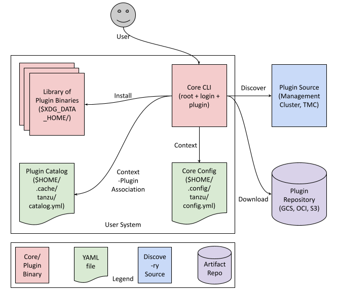

# Contexts, Targets and Plugin Discovery

## Abstract

The Tanzu CLI is an amalgamation of all the Tanzu infrastructure elements under one unified core CLI experience. The core CLI supports a plugin model where the developers of different Tanzu services (bundled or SaaS) can distribute plugins that target functionalities of the services they own. When users switch between different services via the CLI context, we want to surface only the relevant plugins for the given context for a crisp user experience.

## Key Concepts

- CLI - The Tanzu command line interface, built to be pluggable.
- Service - Any tanzu service, user-managed or SaaS. E.g., TKG, TCE, TMC, etc
- Server - An instance of service. E.g., A single TKG management-cluster, a specific TMC endpoint, etc.
- Context - an isolated scope of relevant client-side configurations for a combination of user identity and server identity. There can be multiple contexts for the same combination of {user, server}. This is currently referred to as `Server` in the Tanzu CLI, which can also mean an instance of a service. Hence, we shall use `Context` to avoid confusion.
- Target - a top level entity used to make the control plane, that a user is interacting against, more explicit in command invocations.
- Plugin - A scoped piece of functionality that can be used to extend the CLI. Usually refers to a single binary that is invoked by the root Tanzu CLI.
- Scope - the context association level of a plugin
- standalone - independent of the CLI context
- Context-scoped - scoped to one or more contexts
- Discovery - the interface to fetch the list of available plugins and their supported versions
- Distribution - the interface to deliver a plugin for user download
- Scheme - the specific mechanism to discover or download a plugin
- Discovery Scheme - e.g., REST API, CLIPlugin kubernetes API, manifest YAML
- Distribution Scheme - e.g., OCI image, Google Cloud Storage, S3
- Discovery Source - the source server of a plugin metadata for discovery, e.g., a REST API server, a management cluster, a local manifest file, OCI compliant image containing manifest file
- Distribution Repository - the repository of plugin binary for distribution, e.g., an OCI compliant image registry, Google Cloud Storage, an S3 compatible object storage server
- Plugin Descriptor - the metadata about a single plugin version that is installed locally and is used by the core to construct a sub-command under `tanzu`

## Background and Motivation

### Version Compatibility

When a user is working with multiple instances of a product, we want to automatically select the right set of plugins and plugin versions for use with the instance they’ve connected to. Concretely, using two versions of a product shouldn’t require multiple “installations” of the Tanzu CLI.

### Feature Availability

As more services start adopting the Tanzu CLI for distributing their CLI, the number of available plugins becomes large and creates clutter. We want to make it seamless for the users to understand which plugins (features) are available when they are using a given context on the Tanzu CLI. Also, for some services, some of the features can be gated behind user SKU or feature flags.

### Name Conflicts

The same plugin/command could be available for different control planes; TMC, TKG, TSM, and more, with different APIs and different capabilities. This creates conflicts in plugin names across control planes. Example: TCE, TKG and TMC have their own version of the cluster plugin for cluster life cycle operations but targeting different APIs and endpoints. In some cases even different versions of the same service could require different versions of the same plugin.

## Goals

As a plugin developer I want to,

- Advertise plugins relevant to my Tanzu service instance (server version, features activated, etc.) and to the user identity (privilege level, organization, SKU, etc.). This needs the user to log in to a server.
- Advertise plugins that are agnostic to any server (client-only plugins or standalone plugin). These plugins can be used with/without logging in.
- Mark some plugins as required for interaction with a server by the Tanzu CLI (e.g., cluster plugin)
- Deprecate older plugins which are not supported anymore
- Advertise a recommended version (well tested and recent, but not necessarily the latest) for each plugin
- Maintain support for older plugin versions which still work with the server or alternatively deprecate older plugin versions which are not supported anymore
- Advertise plugin versions which might have a newer UX or preview/untested features, which users would need to deliberately upgrade to
- Install development plugins to a context or standalone for testing purposes
- Communicate that I expect a package to support a range of plugin versions, inclusive of new patch releases of the plugin
- Support OCI image based distribution format

As a user I want to,

- Install the recommended version of all required plugins for the current context during login
- Install the recommended version of any missing required plugin for the current context via a sync command
- Upgrade all installed plugins to newer versions via a sync command, if the installed versions are not supported anymore
- Be prompted or get a warning when upgrading to a plugin version that breaks the old UX
- Avoid re-downloading a plugin version if already present (e.g., if the same version of package plugin is provided by two management clusters, do not re-download it)

## Non Goals

As a developer I want to,

- Specify dependencies between plugins
- Design nested plugins
- Force upgrade deprecated/unsupported plugins for all users of the system that I operate via some policy. Essentially, override the ability of users to skip upgrades.
- Mandate that only signed binaries are consumed by the users

## Requirements

- Generic interface in tanzu-framework to discover and download plugins either standalone or for the current context
- Sophisticated version constraints that can be enforced from the server side
- Unified plugin object schema for discovery and distribution that can be easily adopted by different services
- Local index of all installed plugins with the ability to differentiate between different versions and sources for similar plugins
- Context to plugins mapping in addition to standalone plugins set
- A plugin sync command which can both install new plugins and upgrade installed plugins based on the context

## High-Level Design



## Detailed Design

### Plugin Discovery

Discovery is the interface to fetch the list of available plugins, their supported versions and how to download them either standalone or scoped to a server. E.g., the CLIPlugin API in a management cluster, a similar REST API in TMC, a manifest file in GCP, etc. Unsupported plugins and plugin versions are not returned by the interface. Having a separate interface for discovery helps to decouple discovery (which is usually tied to a server or user identity) from distribution (which can be shared). For MVP, the discovery interface will use the same authentication configuration as the server to fetch relevant plugins by server and user identity. In future, this can be made configurable.

On initialization, the tanzu CLI provides a default standalone discovery source without any authentication for all client-only plugins like login, builder, and codegen. On login, every server type (management cluster or global control plane) provides a default context-scoped discovery source. In future, there can be multiple sources of discovery each with its own authentication configuration under the same context. These can be combined into one logical source via a multi-source discovery implementation similar to the current multi-repo object.

```go
// Discovery is an interface to fetch the list of available plugins.
type Discovery interface {
    // Name of the repository.
    Name() string
    // List available plugins.
    List() ([]plugin.Discovered, error)
    // Describe a plugin.
    Describe(name string) (plugin.Discovered, error)
    // Type returns type of discovery.
    Type() string
}
```

### Distribution

Distribution is the interface to download a plugin version binary for a given OS and architecture combination. E.g., a local file-system, an OCI compliant image repository, etc. In most cases plugin discovery usually happens via a Tanzu service and distribution usually happens via some third party artifact repository service. So, having the separation in the interface only feels natural. It also provides the following advantages,

- Can distribute the same set of plugins via different mechanisms either for redundancy or for location preferences
- Ability to separate the security concerns of the discovery mechanism from that of the distribution mechanism

The specific distribution mechanism of a plugin shall be provided by the discovery source. This allows different discovery sources to distribute their plugins as they see fit.

```go
// Distribution is an interface to download a single plugin binary.
type Distribution interface {
    // Fetch the binary for a plugin version.
    Fetch(version, os, arch string) ([]byte, error)
    // GetDigest returns the SHA256 hash of the binary for a plugin version.
    GetDigest(version, os, arch string) (string, error)
}
```

### Available Plugin

Combining all the above components together, the plugin object returned by the discovery interface is defined as below. Also, for service owners to distribute plugins that other plugins depend on for multiple use cases we add a flag to mark a plugin as required. Plugins marked required shall be downloaded by default when logging in to a server.

```go
// Discovered defines discovered plugin resource
type Discovered struct {
    // Description is the plugin's description.
    Name string

    // Description is the plugin's description.
    Description string

    // RecommendedVersion is the version that Tanzu CLI should use if available.
    // The value should be a valid semantic version as defined in
    // https://semver.org/. E.g., 2.0.1
    RecommendedVersion string

    // SupportedVersions determines the list of supported CLI plugin versions.
    // The values are sorted in the semver prescribed order as defined in
    // https://github.com/Masterminds/semver#sorting-semantic-versions.
    SupportedVersions []string

    // Distribution is an interface to download a single plugin binary.
    Distribution distribution.Distribution

    // Optional specifies whether the plugin is mandatory or optional
    // If optional, the plugin will not get auto-downloaded as part of
    // `tanzu login` or `tanzu plugin sync` command
    // To view the list of plugin, user can use `tanzu plugin list` and
    // to download a specific plugin run, `tanzu plugin install <plugin-name>`
    Optional bool

    // Scope is the context association level of the plugin.
    Scope string

    // Source is the name of the discovery source from where the plugin was
    // discovered.
    Source string

    // ServerName is the name of the server from where the plugin was discovered.
    ServerName string

    // DiscoveryType defines the type of the discovery. Possible values are
    // oci, local or kubernetes
    DiscoveryType string

    // Target defines the target to which this plugin is applicable to
    Target cliv1alpha1.Target

    // Status is the installed/uninstalled status of the plugin.
    Status string
}
```

### Installation Directory Structure

The plugin installations shall be organized similar to the structure of the Golang modules cache.
The installation path is, ${InstallationRoot}/${PluginName}/${Version}_${sha256}_${target}. This has the following advantages,

- Local or development plugins can be handled similar to downloaded ones because the digest shall be different.
- In case a plugin image is copied to a new repository, the binary need not be re-downloaded, since the digest will be the same.
- Easy to look-up all the installed versions for a given plugin.

 A sample installation tree can be found below.

```sh
$ tree $HOME/Library/ApplicationSupport/tanzu-cli/

/Users/anujc/Library/ApplicationSupport/tanzu-cli/
├── builder
│   ├── dev_6682658a8c08dc2c6228d74cd6cca9e3e539d32c8a00a7a33ea15f6bdeb3ded2_
│   └── v1.4.0_<sha256...>_<target>
├── cluster
│   ├── v0.3.1_e9af6d713c611128dce411dd44541a95a73688592edb6eba2f4ecff7c7a7ca97_k8s
│   ├── v1.3.1_a9af6d713c611128dce411dd44541a95a73688592edb6eba2f4ecff7c7a7ca97_k8s
│   └── v1.4.0_b9af6d713c611128dce411dd44541a95a73688592edb6eba2f4ecff7c7a7ca97_tmc
├── login
│   └── v1.3.1_c9af6d713c611128dce411dd44541a95a73688592edb6eba2f4ecff7c7a7ca97_
├── management-cluster
│   └── v0.3.2_d9af6d713c611128dce411dd44541a95a73688592edb6eba2f4ecff7c7a7ca97_k8s
└── package
    ├── v1.4.0_f9af6d713c611128dce411dd44541a95a73688592edb6eba2f4ecff7c7a7ca97_k8s
    └── v0.4.1-pre_g9af6d713c611128dce411dd44541a95a73688592edb6eba2f4ecff7c7a7ca97_k8s
```

### Installed Plugin

The metadata (description, version, buildSHA, documentation URL, etc.) about an installed plugin version is maintained in the PluginDescriptor object.  This information is needed to create a sub-command under the root tanzu command and this object is already present. To uniquely identify an installation we need the binary digest and the relative path of the plugin version under the installation root.

```go
// PluginDescriptor describes an installed plugin binary.
type PluginDescriptor struct {
    ...
    // Digest is the SHA256 hash of the plugin binary.
    Digest string `json:"digest"`
    // Relative installation path of a plugin to uniquely identify an installation.
    // E.g., management-cluster/v0.3.2@sha256:...
    InstallationPath string `json:"installationPath"`
    ...
}
```

### Context-mapping

The plugin descriptors are stored in the catalog cache, ${HOME}/.cache/tanzu/catalog.yaml, which is looked up on invocation of every tanzu CLI command.
Catalog contains following information for the installed plugins.

- Index the installations by path to easily look up the PluginDescriptors
- Map the set of relevant plugin installations to a specific context or to be standalone to display only available plugins for a context (in case of a name conflict between standalone and context-scoped plugins the context-scoped plugin takes precedence)

Note: Similar to the go modules we propose to set only read and executable permissions on the installations to discourage the user from deleting an installation which can break the index.

```go
// PluginAssociation is a set of plugin names-target and their associated installation paths.
type PluginAssociation map[string]string

// Catalog denotes a collection of installed Tanzu CLI plugins.
type Catalog struct {
    ...
    // IndexByPath of PluginDescriptors for all installed plugins by installation path.
    IndexByPath map[string]PluginDescriptor `json:"indexByPath,omitempty"`
    // IndeByName of all plugin installation paths by name.
    IndexByName map[string][]string `json:"indexByName,omitempty"`
    // StandAlonePlugins is a set of standalone plugin installations.
    StandAlonePlugins PluginAssociation `json:"standAlonePlugins,omitempty"`
    // ServerPlugins links a server and a set of associated plugin installations.
    ServerPlugins map[string]PluginAssociation `json:"serverPlugins,omitempty"`
}
```

### Sync Command

The existing plugin install and plugin upgrade commands operate only on single plugins. We propose to add a new plugin sync command that combines the behavior of install and upgrade, and also handles multiple plugins within a context. For MVP, it only installs the recommended version of required plugins for the context. Also, while upgrading it only upgrades if the installed version is not supported anymore and by default picks the recommended version. In future, which plugins to install/upgrade and which target version to pick shall be configurable.

```sh
$ tanzu plugin sync -h
Synchronize the plugins for the current context

Usage:
tanzu plugin sync [flags]

Flags:
  -h, --help             help for install

```

Internally, the same logic is called from the login command implicitly.

1. All the plugin sync scenarios (explicit and implicit) involve the following general flow.
1. List available plugins through the discovery interface
1. Select new plugins for installation based on some criteria (only required plugins for MVP) and select installed plugins for upgrade based on some criteria (only plugins with unsupported versions)
1. Select a version based on some criteria (only recommended version for MVP)
1. For upgrades, prompt the user for confirmation if any of the selected versions has a newer major version than the installed version
1. Download the selected plugin versions, if not already present, to the installation root directory in the relative path provided by the distribution interface
1. Update the plugin installation index and the context association map in the catalog cache with the new plugin descriptors

## User workflows

### Setup

Download and install the Tanzu CLI

```sh
install tanzu/cli/core/v0.8.0/tanzu-core-darwin_amd64 /usr/local/bin/tanzu
```

This will initialize the tanzu configuration file with the default discovery config for standalone plugins.

```sh
$ tanzu plugin source list
  NAME             TYPE    SCOPE
  default          OCI     standalone
```

Plugin list will display plugins from the default discovery source.

```sh
$ tanzu plugin list
  NAME                DESCRIPTION                                                        SCOPE       DISCOVERY   TARGET  VERSION      STATUS
  login               Login to the platform                                              Standalone  default             v0.11.0-dev  not installed
  management-cluster  Kubernetes management-cluster operations                           Standalone  default     k8s     v0.11.0-dev  not installed
  package             Tanzu package management                                           Standalone  default     k8s     v0.11.0-dev  not installed
  pinniped-auth       Pinniped authentication operations (usually not directly invoked)  Standalone  default             v0.11.0-dev  not installed
  secret              Tanzu secret management                                            Standalone  default     k8s     v0.11.0-dev  not installed
```

Run sync command to download the latest version of all plugins

```sh
$ tanzu plugin sync
Checking for required plugins ...
Installing plugin 'login' ...
Installing plugin 'management-cluster' ...
Installing plugin 'package' ...
Installing plugin 'secret' ...

✓ Done
```

```sh
$ tanzu plugin list
  NAME                DESCRIPTION                                                        SCOPE       DISCOVERY   TARGET  VERSION      STATUS
  login               Login to the platform                                              Standalone  default             v0.11.0-dev  installed
  management-cluster  Kubernetes management-cluster operations                           Standalone  default     k8s     v0.11.0-dev  installed
  package             Tanzu package management                                           Standalone  default     k8s     v0.11.0-dev  installed
  secret              Tanzu secret management                                            Standalone  default     k8s     v0.11.0-dev  installed
```

### Context Creation

#### With new install

Creating a new context will discover all available plugins from the context and will download them.

```sh
tanzu login --kubeconfig path/to/kubeconfig --context context-name --name vsphere-mc-1
# or
$ tanzu context create --management-cluster --kubeconfig path/to/kubeconfig --context path/to/context --name vsphere-mc-1
✓ Successfully logged into the management cluster vsphere-mc-1

Checking for required plugins ...
Downloading plugin 'cluster' ...
Downloading plugin 'kubernetes-release' ...

✓ Done
```

`tanzu plugin list` will display all standalone plugins as well as context-scoped plugins from all active contexts.
There can be one active context per target.

Assume below configuration as part of the config file where there is one active context for both the supported targets.
`tanzu plugin list` should discover and show plugins from both the contexts.

```yaml
currentContext:
  k8s: vsphere-mc-1
  tmc: tmc-unstable
```

```sh
$ tanzu plugin list
  NAME                DESCRIPTION                                                        SCOPE       DISCOVERY              TARGET  VERSION      STATUS
  cluster             Kubernetes cluster operations                                      Context     default-vsphere-mc-1   k8s     v0.11.0-dev  installed
  kubernetes-release  Kubernetes release operations                                      Context     default-vsphere-mc-1   k8s     v0.11.0-dev  installed
  login               Login to the platform                                              Standalone  default                        v0.11.0-dev  installed
  management-cluster  Kubernetes management-cluster operations                           Standalone  default                k8s     v0.11.0-dev  installed
  package             Tanzu package management                                           Standalone  default                k8s     v0.11.0-dev  installed
  secret              Tanzu secret management                                            Standalone  default                k8s     v0.11.0-dev  installed
  iam                 Identity management operations                                     Context     default-tmc-unstable   tmc     v0.1.0       installed
```

#### No new install

Creating a new similar context will discover all available plugins from new context and will download them that are not already installed.

```sh
tanzu login --kubeconfig path/to/kubeconfig --context context-name --name vsphere-mc-2
# or
$ tanzu context create --management-cluster --kubeconfig path/to/kubeconfig --context path/to/context --name vsphere-mc-2
✓ Successfully logged into the management cluster vsphere-mc-2

Checking for required plugins ...
All required plugins are already installed.

✓ Done
```

### Plugin Sync

Explicitly calling the plugin sync command will discover and download new required plugins within the context of a server. It will also upgrade installed plugin versions which are not supported anymore to newer versions.

#### No new install or upgrade

```sh
$ tanzu plugin sync
Checking for required plugins ...
All required plugins are already installed.

Checking for outdated plugin versions ...
All installed plugins are up-to-date.

✓ Done
```

#### With new install & upgrade

When a new or existing plugin is marked as required it gets downloaded on sync, if not already present. When the installed version is not present in the supported versions list it gets upgraded to the recommended version. If the recommended version has a newer major version than the installed version, the user is prompted for confirmation.

```sh
$ tanzu plugin sync
Checking for required plugins ...
Installing plugin 'login' ...

Checking for outdated plugin versions ...
? Some of the installed plugins (cluster) need to be updated to a new version. Do you want to continue [y/N]? y
Downloading ‘cluster’ plugin ...

✓ Done
```

```sh
$ tanzu plugin list
  NAME                DESCRIPTION                                                        SCOPE       DISCOVERY             TARGET  VERSION      STATUS
  cluster             Kubernetes cluster operations                                      Context     default-vsphere-mc-1  k8s     v0.11.0-dev  installed
  kubernetes-release  Kubernetes release operations                                      Context     default-vsphere-mc-1  k8s     v0.11.0-dev  installed
  login               Login to the platform                                              Standalone  default                       v0.11.0-dev  installed
  management-cluster  Kubernetes management-cluster operations                           Standalone  default               k8s     v0.11.0-dev  installed
  package             Tanzu package management                                           Standalone  default               k8s     v0.11.0-dev  installed
  pinniped-auth       Pinniped authentication operations (usually not directly invoked)  Standalone  default                       v0.11.0-dev  installed
  secret              Tanzu secret management                                            Standalone  default               k8s     v0.11.0-dev  installed
  iam                 Identity management operations                                     Context     default-tmc-unstable  tmc     v0.1.0       installed
```

### Development Plugins

Installing development plugins copies the plugin binary to the installation directory under the appropriate directory for local distribution. For development purpose we will be utilizing 'local' discovery and distribution interface implementation. This will allow developers to install their development plugins as a standalone plugins. If Tanzu CLI is built with default standalone discovery type as 'local', this local standalone discovery will have higher precedence than plugin discovery returned by the management cluster itself. Tanzu CLI with 'local' default standalone discovery should only be used for development purposes and not for the production usecase.

### Installing Plugins from Local Source

Generally we expect most of the users to install the plugins from the default OCI based discovery mechanism. However tanzu CLI handles another way of installing plugins by downloading `tar.gz` files for the plugins and using that to list and install available plugins.

To install the plugin with local source, download the plugin `tar.gz` from the release artifacts for your distribution and untar it to a location on your local machine. You can use the directory where the `tar.gz` has been extracted with the `tanzu plugin list --local` and `tanzu plugin install --local` command as mentioned below.

- List the plugins without `--local`: Lists all available default plugins from the default OCI registry

  ```sh
  $ tanzu plugin list
    NAME                DESCRIPTION                                                        SCOPE       DISCOVERY  TARGET  VERSION      STATUS
    login               Login to the platform                                              Standalone  default            v0.13.0-dev  not installed
    management-cluster  Kubernetes management-cluster operations                           Standalone  default    k8s     v0.13.0-dev  not installed
    package             Tanzu package management                                           Standalone  default    k8s     v0.13.0-dev  not installed
    pinniped-auth       Pinniped authentication operations (usually not directly invoked)  Standalone  default            v0.13.0-dev  not installed
    secret              Tanzu secret management                                            Standalone  default    k8s     v0.13.0-dev  not installed
  ```

- List the plugins with `--local` pointing to local plugin directory: Lists only available plugins from given local file path

  ```sh
  $ tanzu plugin list --local /tmp/admin/tanzu-plugins/
    NAME     DESCRIPTION                 SCOPE       DISCOVERY  TARGET  VERSION      STATUS
    builder  Build Tanzu components      Standalone                     v0.13.0-dev  not installed
    codegen  Tanzu code generation tool  Standalone                     v0.13.0-dev  not installed
    test     Test the CLI                Standalone                     v0.13.0-dev  not installed
  ```

- Install plugins `--local` flag: Only installs plugins from given local file path and doesn't install plugins from default OCI registry

  ```sh
  $ tanzu plugin install all --local /tmp/admin/tanzu-plugins/
  Installing plugin 'builder:v0.13.0-dev'
  Installing plugin 'codegen:v0.13.0-dev'
  Installing plugin 'test:v0.13.0-dev'
  Successfully installed all plugins
  ✔  successfully installed 'all' plugin
  ```

- List all installed plugins: Plugins installed with `tanzu plugin install all --local /tmp/admin/tanzu-plugins/` will not display `DISCOVERY` information, but will be listed as part of `list` command output

  ```sh
  $ tanzu plugin list
    NAME                DESCRIPTION                                                        SCOPE       DISCOVERY  TARGET  VERSION      STATUS
    login               Login to the platform                                              Standalone  default            v0.13.0-dev  not installed
    management-cluster  Kubernetes management-cluster operations                           Standalone  default    k8s     v0.13.0-dev  not installed
    package             Tanzu package management                                           Standalone  default    k8s     v0.13.0-dev  not installed
    pinniped-auth       Pinniped authentication operations (usually not directly invoked)  Standalone  default            v0.13.0-dev  not installed
    secret              Tanzu secret management                                            Standalone  default    k8s     v0.13.0-dev  not installed
    builder             Build Tanzu components                                             Standalone                     v0.13.0-dev  installed
    codegen             Tanzu code generation tool                                         Standalone                     v0.13.0-dev  installed
    test                Test the CLI                                                       Standalone                     v0.13.0-dev  installed
  ```

- List plugins with `--local` that are discovered with default discovery. Let's assume `/tmp/default-package-secret/tanzu-plugins/` contains `package` and `secret` plugins

  ```sh
  $ tanzu plugin list --local /tmp/default-package-secret/tanzu-plugins/
    NAME                DESCRIPTION                  SCOPE       DISCOVERY  VERSION      STATUS
    package             Tanzu package management     Standalone             v0.12.0-dev  not installed
    secret              Tanzu secret management      Standalone             v0.13.0-dev  not installed
  ```

- Install plugins with `--local` that are discovered with default discovery

  ```sh
  $ tanzu plugin install all --local /tmp/default-package-secret/tanzu-plugins/
  Installing plugin 'package:v0.12.0-dev'
  Installing plugin 'secret:v0.13.0-dev'
  Successfully installed all plugins
  ✔  successfully installed 'all' plugin
  ```

- List all installed plugins: As `package` and `secret` plugins can also be discovered with default discovery it will be displayed as `installed` with discovery information mentioned. Status of `package` plugin should list `update available` as the installed version is `v0.12.0-dev` but version `v0.13.0-dev` is discovered from the default discovery.
- Note: When the plugin is installed (even if the update is available) the `VERSION` field will show installed version of the plugin. When plugin is not installed, `VERSION` field will show discovered recommended version for the plugin.

  ```sh
  $ tanzu plugin list
    NAME                DESCRIPTION                                                        SCOPE       DISCOVERY  TARGET  VERSION      STATUS
    login               Login to the platform                                              Standalone  default            v0.13.0-dev  not installed
    management-cluster  Kubernetes management-cluster operations                           Standalone  default    k8s     v0.13.0-dev  not installed
    package             Tanzu package management                                           Standalone  default    k8s     v0.12.0-dev  update available
    pinniped-auth       Pinniped authentication operations (usually not directly invoked)  Standalone  default            v0.13.0-dev  not installed
    secret              Tanzu secret management                                            Standalone  default    k8s     v0.13.0-dev  installed
    builder             Build Tanzu components                                             Standalone                     v0.13.0-dev  installed
    codegen             Tanzu code generation tool                                         Standalone                     v0.13.0-dev  installed
    test                Test the CLI                                                       Standalone                     v0.13.0-dev  installed
  ```

- Running `tanzu plugin sync` will sync all the plugins that can be discovered with the discovery. In this case, `login`, `management-cluster`, `pinniped-auth` will get installed. `package` plugin will get updated to newly available version. `secret` plugin installation will be skipped as no new version is available. And `builder`, `codegen`, `test` plugins will not get considered with sync command as there is no `discovery` source associated with this plugins

  ```sh
  $ tanzu plugin sync
  Installing plugin 'login:v0.13.0-dev'
  Installing plugin 'management-cluster:v0.13.0-dev'
  Installing plugin 'package:v0.13.0-dev'
  Installing plugin 'pinniped-auth:v0.13.0-dev'
  Successfully installed all plugins
  ✔  successfully installed 'all' plugin
  ```

- Clean all installed plugins with `tanzu plugin clean` will delete all installed plugins

- Listing plugin after deleting all plugin will not show locally installed plugins because those plugins did not had any `discovery` source associated with them

  ```sh
  $ tanzu plugin list
    NAME                DESCRIPTION                                                        SCOPE       DISCOVERY  TARGET  VERSION      STATUS
    login               Login to the platform                                              Standalone  default            v0.13.0-dev  not installed
    management-cluster  Kubernetes management-cluster operations                           Standalone  default    k8s     v0.13.0-dev  not installed
    package             Tanzu package management                                           Standalone  default    k8s     v0.13.0-dev  not installed
    pinniped-auth       Pinniped authentication operations (usually not directly invoked)  Standalone  default            v0.13.0-dev  not installed
    secret              Tanzu secret management                                            Standalone  default    k8s     v0.13.0-dev  not installed
  ```

### Image Repository Override for OCI distribution with K8s discovery

- Allow registry override for installation of context-scoped plugins with `tanzu plugin install` or `tanzu plugin sync` when talking to management-cluster even if the CLIPlugin resources are pointing to different image registry.

- This is supported for context-scoped plugins which are using OCI based distribution and are getting discovered using K8s discovery.

- To do this type of override of image repository, admin needs to create a ConfigMap in `tanzu-cli-system` namespace with `cli.tanzu.vmware.com/cliplugin-image-repository-override: ""` label on the management cluster will following details:

```yaml
apiVersion: v1
kind: ConfigMap
metadata:
  name: context-plugin-repository-override
  namespace: tanzu-cli-system
  labels:
    cli.tanzu.vmware.com/cliplugin-image-repository-override: ""
data:
  imageRepoMap: |-
    projects.registry.vmware.com/tkg: private.custom.repo.com/tkg
```

- Also make sure that all logged in users have permission to read this ConfigMap.

- Tanzu CLI will read this ConfigMap and while downloading context-scoped plugins it can update the image repository references accordingly.

## Open Issues

Below mentioned issue track all work related to API-driven plugin discovery and context aware tanzu cli:

- [API-driven discovery of CLI plugins](https://github.com/vmware-tanzu/tanzu-framework/issues/74)
