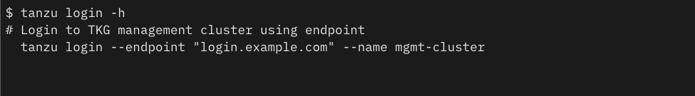
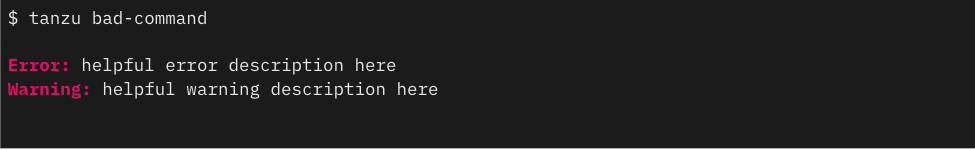
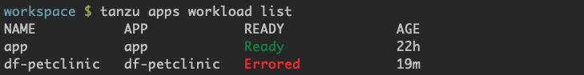
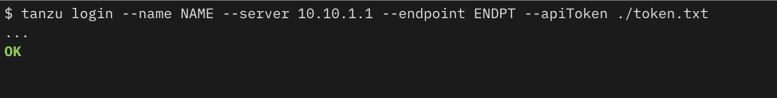
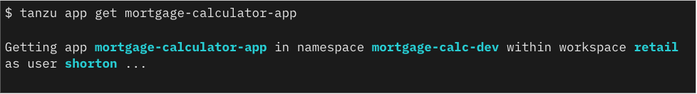

# Tanzu CLI Styleguide

## Tanzu CLI mission statement

The Tanzu CLI aims to provide a consistent experience for users of the Tanzu portfolio

This document is intended to provide direction for designing Tanzu CLI plugins so
that they adhere to established patterns

------------------------------

## Styleguide Checklists

Two checklists to help contributors design and develop styleguide-consistent commands are available.

* The [design-stage checklist](design_stage_styleguide_checklist.md) is meant to be used prior to implementation.
* The [build-stage checklist](build_stage_styleguide_checklist.md) is meant to be used during implementation.

## Design Principles

### Prioritize human users first

* Default to human readable output, but support plaintext and json/yaml options
* Use straightforward, simple language and syntax
* Use machine readable output where it does not impact usability

### Prioritize discoverability, consistency and predictability

* Consistent language, structure, and as much as possible, behaviors across interfaces

### Be as helpful as possible

* Invest time in your help and error text
* Provide examples
* Command line completion should be used whenever possible
* Provide context info whenever possible (ie feedback messages, etc)

### The Tanzu CLI should be declarative whenever possible

* Most APIs should be made declarative, and the CLI commands should supply basic `apply` operations on those data models

### The CLI should contain as little logic as possible

* Avoid complex client logic, maintaining state; prefer server side logic

### The CLI must be accessible

* We should not exclude users by deprioritizing accessibility
* Features like search filters and output limits are useful for folks using assistive technology
* Screen-readers and automation are both served by being thoughtful with the use of non machine-readable characters (emojis, ascii spinners, etc.)

------------------------------

## Designing commands

The Tanzu CLI uses the following pattern

```sh
tanzu [global flags] noun [sub-noun] verb RESOURCE-NAME [flags]
```

Example

```sh
tanzu cluster create NAME
tanzu management-cluster kubeconfig get --admin
```

### Global Flags

Global flags are maintained by the Tanzu CLI SIG and adding to the current global set should be managed through the SIG

### Nouns

Any nouns being added must exist in the [Shared Taxonomy document](/hack/linter/cli-wordlist.yml)

* Introducing nouns to support the creation of new commands and/or subcommands should be reviewed by the Tanzu CLI SIG

Compound words should be `-` delimited

```sh
management-cluster not managementcluster nor managementCluster
```

Nouns should not be combined with verbs

```txt
tanzu app get, not tanzu app-get
```

### Verbs

Use the standard CRUD verbs whenever possible

* Tanzu CLI uses create, delete, get, list, update

  If at all possible, use pre-existing verbs from the [Shared Taxonomy document](/hack/linter/cli-wordlist.yml)

* New verbs must be reviewed by the Tanzu CLI SIG

  Opposing commands should take the form of antonyms

Example

```txt
‘assign quota’ and ‘unassign quota’
```

### Sub-Noun

Plugin specific sub-nouns do not need to be reviewed by the governance group.
Please review the [Shared Taxonomy document](/hack/linter/cli-wordlist.yml) when using sub-nouns, and make sure you're using the noun consistently if it's already being used.

#### Nesting

Commands should not nest more than two layers of sub-nouns:

* _Yes_: `tanzu plugin-name noun sub-noun verb --flags`…
* _No_: `tanzu plugin-name noun sub-noun sub-sub-noun verb --flags`…

### Positional Arguments

* There should no more than 1 positional argument
* Ideally, the positional argument should be the name/subject of the thing the command refers to (not some other flaggable property)

Example

```sh
tanzu cluster create CLUSTER-NAME [flags]
```

### Flags

* Use standard names for flags if there is one (flags used in the cli are documented [here](../../pkg/v1/cli/command/plugin/lint/cli-wordlist.yml))
* When using flags to specify different aspects of the same object, including the object name in the flag can be helpful. `tanzu foo list --bar --bar-uid "..."` and `tanzu foo list --bar-name --bar-uid "..."` are both in use, choose whichever pattern makes more sense for your plugin.

* Where possible, set reasonable defaults for flag-able options that align with expected workflows
* A user should only be required to explicitly set a max of 2 flags
* Add as many flags as necessary to configure the command
* Consider supporting the use of a config file if the number of flags exceeds 5
* Flags should be tab completed. The Tanzu CLI uses the cobra framework, which has tooling to help with this [Cobra shell completion docs](https://github.com/spf13/cobra/blob/master/shell_completions.md)

#### Resource flags

The Tanzu CLI follows [kubectl patterns](https://kubernetes.io/docs/concepts/configuration/manage-resources-containers/#resource-units-in-kubernetes) for specifying resource units.

CPU units
`m (millicpu)`
Example

```txt
# 100m, .1, 1
$tanzu apps workload update <name> --limit-cpu 8
```

Memory units
`E, P, T, G, M, K, Ei, Pi, Ti, Gi, Mi, Ki.`

Example

```txt
# 128974848, 129e6, 129M , 123Mi
$tanzu apps workload update <name> --limit-memory 16G
```

#### Time duration flags

The Tanzu CLI follows [go patterns](https://pkg.go.dev/time#ParseDuration) for specifying time duration.

Time units
`ns, us (or µs), ms, s, m, h`

Example

```txt
# 300ms, -1.5h or 2h45m
$ tanzu apps workload delete <name> --wait-timeout 10m
```

### Prompting

* If you are prompting for a secret, do not echo it in the terminal when the user types
  * Commands should accept secrets via environment variables
* Commands should not prompt when TTY is not present
  * The component library can provide this check, pending resolution of issue #330

### Command principles

* Support verbosity flags
* Provide a way to deactivate interactive prompting (`--quiet`, `--force`, `--yes`)

### Components - Command

Available for plugins written in golang.

CLI commands should utilize the plugin component library in [pkg/cli/component](https://github.com/vmware-tanzu/tanzu-framework/tree/main/pkg/v1/cli/component) for interactive features like prompts or table printing.

Available input components:

* Prompt
* Select

------------------------------

## Designing feedback

### Feedback principles

Useful for everyone, critical to the usability of screen-readers and automation
Support verbosity flags (`-v`, `--verbose`).

`--format` to define preferred output

* Useful for humans and machine users, ie table, value, json, csv, yaml, etc

`--filter`

* To refine the output criteria

For list commands, consider supporting `--limit` to set a maximum number of responses.

* `--page-size` to define the number of resources per page if using pagination
* `--sort-by` to specify what field to organize the list by

If using color to communicate information, don't let it be the only indicator.

### Confirmation prompting

* To protect against unintended destructive actions, the CLI should confirm user intentions before executing commands such as ‘delete’
* It can be helpful to describe the impact of an action if not obvious
* The default action should be to cancel if no input is provided

Example

```txt
$ tanzu cluster delete MY_CLUSTER

This action impacts all apps in this cluster. Deleting the cluster will remove associated apps
Really delete the cluster MY_CLUSTER [y/N]
MY_CLUSTER has not been deleted
```

* To deactivate all interactive prompts when running cli commands (helpful for scripting purposes) the CLI should support a --yes or -y, option

Example

```txt
tanzu cluster delete MY_CLUSTER --yes
```

### Confirmation feedback

When executing a command, repeat back the command and context to the user.

Example

```txt
$ tanzu app create NAME
Creating app NAME in namespace NAMESPACE as user USERNAME
```

### Progress reporting

For long running processes, don't go for a long period without output to the user. Outputting something like ’Processing…’, or a spinner can go a long way towards reassuring the user that their command went through.

### Warnings

In the confirmation feedback, include a notice for experimental or beta commands.

Example

```txt
“Warning: This is a EXPERIMENTAL command and may change without notice.”
“Warning: This is a BETA command and may change without notice.”
```

------------------------------

## Designing outputs

### stdout

* Primary output for both human and machine users.

### stderr

* Output for messages, warnings, errors.
* Stderr output is shown to the user, but not included when piping commands together.

### Exit codes

* When a command succeeds without error, the process should exit with code.
* When a command fails for any reason (invalid flags, failed API request, etc.), the process should exit with code.
* When a multi-step command fails at any step, the process should exit with code.
* When an operation is meant to be idempotent (like creating a resource  that already exists, or deleting a resource that’s already been deleted), the process should exit with code.

### Feedback when a process completes

#### For asynchronous commands

* Exit 0 - the command was successful issued AND
* Return a line telling the user how to check status of the command

#### For synchronous commands

* Feedback could be an error message with exit code 1 OR
* Confirmation of completion (i.e. “OK”, “done”) with exit code 0

### Tables

* Tables are the default output format for list commands
* Column headers are upper case
* Columns are separated by three spaces from the longest key/value
* If there aren’t any  values for a column, the column heading should be displayed and values  left empty - don’t conditionally remove or hide a column
* If there are no values for a table, the table is replaced with a message, like ‘No apps found’

Example

```txt
NAME             STATUS   CPU   MEM   NAMESPACE            WORKSPACE
calculator-app   running  53%   18%   mortgage-calc-dev
calculator-bpp   running  93%   21%   mortgage-calc-test
calculator-cpp   running  23%   77%   mortgage-calc
```

### Time format

The Tanzu CLI, like kubectl uses the ISO 8601 standard for date and time

* Compact, consistent width, app/server's timezone

Example

```txt
2021-03-02T15:43:12.41-0700
```

### Key:value pairs

* Key and value always lowercase
* Key followed by a colon (:)
* Values  left-aligned
* Value column separated by three spaces from the longest key
* If no value for a key, key is displayed, value left empty

Example

```txt
name:        morgage-calculator-app
namespace:   morgage-cal-dev
workspace:   mort-calc-dev
status:
url:         http://myapplicationurl.com
```

### Color

* Color is helpful to highlight important information or to convey status, however it should be an enhancement to the text, and not be relied on as the sole source of a given bit of information because it can be deactivated in a user's terminal or may not be accessible to automation or screenreaders. Making status text red when it says `not ready` is ok because without the red, the status can still be determined. If, for example, the name of the resource was made red when not-ready it would not be possible to know the state of the resource if color was deactivated.
* Colors can be deactivated using an environment variable (NO_COLOR=TRUE)
* Colors are always deactivated when the session is not a TTY session. This allows for the piping of CLI output into other commands (e.g. grep) or machine reading without including stray color characters (pending issue #369)
* Usage tips are always in plain text, even when referencing text that might normally be colorized



#### Don't add color to anything outside of the following conventions to convey contex

* Red = warning, danger

  The word 'Warning:' or 'Error:' is colorized and bold, the *message* is plain text




* Green = success, informational

  Confirmation of completion when a command runs is colorized and bold.



* Cyan = stability, calm, informationa

In command feedback: resources, and user name is colorized and bold.

Interactive prompting: user input is colorized, as is the preceding question mark.




### Animation

* Deactivate if stdout is not an interactive terminal
  * The component library can provide this check

### Symbols / Emojis

* Currently no standards or guidance
* Recommendation is to discuss plans for emoji/symbol use with SIG
* Deactivate if stdout is not an interactive terminal
  * The component library can provide this check

### Components - Output

* Available for plugins written in golang

  CLI commands should utilize the plugin component library in pkg/cli/component for interactive features like prompts or table printing.

  Available output components

  * Table

------------------------------

## Designing help text

Commands will display help if passed -h, --help, or if no options are passed and a command expects them.

### The help text can provide a support path for feedback and issues

* A github link or website URL in the top level help encourage user feedback

Example

```txt
$tanzu package -h
Tanzu package management
Additional documentation is available at https://docs.vmware.com/en/VMware-Tanzu-Kubernetes-Grid/1.3/vmware-tanzu-kubernetes-grid-13/GUID-tanzu-cli-reference.html
...
Flags:
  -h, --help              help for package
      --log-file string   Log file path
```

### All commands and flags should have description text

* If possible, the text should fit on an 80 character wide screen, to prevent word wrap that makes it harder to read.
* Description text begins with a capital letter and does not end with a period
Example

```txt
Available command groups:
  Build
    apps                    Applications on Kubernetes

  Manage
    integration             Get available integrations and their information from registry

  Run
    cluster                 Kubernetes cluster operations
    kubernetes-release      Kubernetes release operations
    management-cluster      Kubernetes management cluster operations
    package                 Tanzu package management
```

### Any complex command should have examples demonstrating its functionality

Example

```txt
$ tanzu login -h
# Login to TKG management cluster using endpoint
    tanzu login --endpoint "https://login.example.com"  --name mgmt-cluster

# Login to TKG management cluster by using kubeconfig path and context for the management cluster
    tanzu login --kubeconfig path/to/kubeconfig --context path/to/context --name mgmt-cluster

# Login to an existing server
    tanzu login --server mgmt-cluster
```

------------------------------

## Designing error and warning text

Use output warnings sparingly. When used often they can create a lot of noise and users may learn to ignore them

Try to write clear and concise errors, which tell the user what action (if any) must be taken. Ideally users won’t have to ask for help or check documentation to recover

Make errors informative. A great error message should contain the following

* Error code / Error title, if applicable
* Error description - what happened
* How to fix the error
* URL to documentation for user’s specific error, if applicable

Example

```sh
$ myapp dump -o myfile.out
Error: EPERM - Invalid permissions on myfile.out
Cannot write to myfile.out, file does not have write permissions
Fix with: chmod +w myfile.out
https://github.com/tanzu/core/help/2323
```

```sh
$ tanzu namespace get EXAMPLE
Error: Namespace EXAMPLE not found. Try 'tanzu namespace list' to see available options
```

Use context in error messages to ease recovery

* If a parameter is invalid or missing, it is a chance to be helpful by telling the user exactly what they missed

  ```sh
  EXAMPLE “You forgot to enter the --name, apps in this namespace include App1, App2, etc...”
  ```

Make it easy to submit bug reports and feedback

* Consider including a github URL, or link to a form in error or help text
* If possible pre-populate form information to make the report as useful while not burdening the user

------------------------------

### Plugins

For information about developing plugins, see the [Plugin Guide](https://github.com/vmware-tanzu/tanzu-framework/blob/main/docs/cli/plugin_implementation_guide.md)

### Contributions to the Style Guide

A styleguide is never done, and should change to meet the changing needs
To propose changes please create an issue, and add it to the CLI SIG agenda to discuss

------------------------------

### Precedent

Olympus Design System
PKS styleguide
cf-cli styleguide

### Accessibility Guidelines

* Web Content Accessibility Guidelines [WCAG](https://www.w3.org/TR/2008/REC-WCAG20-20081211/)
* US section 508 [link](https://www.section508.gov/)
