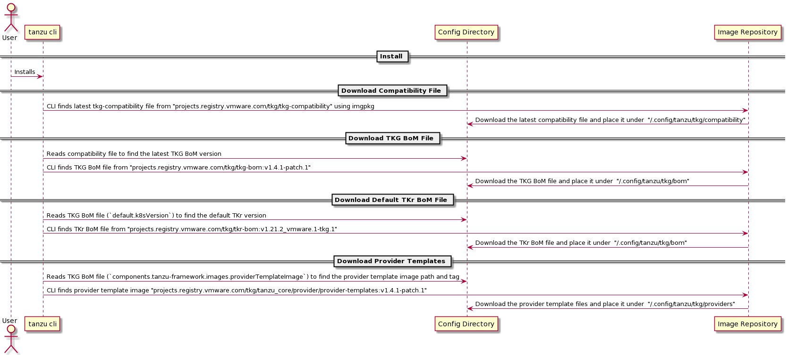

# Bill of Materials (BoM) and Provider Templates

This section describes what is Bill of Materials(BoM) yaml files and provider template files and how those files are used with the TKGLib.

## Bill of Materials (BoM)

A bill of materials (BoM) yaml file is a comprehensive list of components (includes versions and container image information) that will be used by TKGLib for managing management and workload clusters. This includes TKG BoM file and TKr BoM files.

To determine which TKG BoM file to use when using specific version of library there is a concept of TKG compatibility file. There is only one TKG BoM file associated with the given library which is determined by reading the TKG compatibility file.

### TKG BoM file

- Contains information about TKG related component which mainly gets associated with management cluster creation
- This file includes the TKG version under `release.version` key and default TKr version under `default.k8sVersion` key
- This includes cluster-api provider components, image repository information, and many more. 

### TKr (Tanzu Kubernetes release) BoM file

This file contains information related to 
- specific k8s version
- node images to use with (vsphere, aws, azure) for the given k8s version
- add-ons specific components

### TKG Compatibility file

- Specifies which TKG BoM file to use(download) for the given management-cluster plugin

### How the BoM files are published?

The set of Compatibility, TKG and TKr BoM files are published as an OCI container images (using imgpkg) and when user installs or executes any command, appropriate files are downloaded to the user's machine from the image repository. Next section describes how these files are downloaded to the user's machine.

### How BoM files are downloaded to user's machine?

When using the tanzu CLI, Compatibility and BoM files are placed under `~/.config/tanzu/tkg/compatibility` and `~/.config/tanzu/tkg/bom`. Below are the steps which download the corresponding BoM files to the user's machine.

1. When building the `management-cluster` plugin `TKG_DEFAULT_IMAGE_REPOSITORY` and `TKG_DEFAULT_COMPATIBILITY_IMAGE_PATH` variables are provided to tell the plugin from where to fetch the `tkg-compatibility` file. 
1. As part of ensuring prerequisites and configuring `~/.config/tanzu/tkg` directory, CLI fetches latest tkg-compatibility file from `projects-stg.registry.vmware.com/tkg/tkg-compatibility` path. 
1. Assuming latest tag for the tkg-compatibility is `v1`, CLI will fetch the latest compatibilty file and will place the file under `~/.config/tanzu/tkg/compatibility`.

    ### tkg-compatibility.yaml
    ```
    version: v1
    managementClusterPluginVersions:
    - version: v1.4.0
      supportedTKGBomVersions:
        - imagePath: tkg-bom
          tag: v1.4.0
    - version: v1.4.1
      supportedTKGBomVersions:
        - imagePath: tkg-bom
          tag: v1.4.1-patch.1
    ```

1. Library reads this tkg-compatibility file and finds the matching management-cluster plugin version from `managementClusterPluginVersions` list and determinesd the TKG BoM file image path and image tag.
1. Assuming the management-cluster plugin version is `v1.4.1`, library will download corresponding TKG BoM file from `projects-stg.registry.vmware.com/tkg/tkg-bom:v1.4.0-patch.1` and place the file under `~/.config/tanzu/tkg/bom`

1. Once we download the TKG BoM file, we still need to download corresponding default TKr BoM file as both TKG and default TKr BoM files are used to create management cluster.
1. Library determines the default TKr version from TKG BoM file `default.k8sVersion` section. And downloads TKr BoM file from `projects-stg.registry.vmware.com/tkg/tkr-bom:v1.21.2_vmware.1-tkg.1`

    ### tkg-bom-v1.4.1.yaml
    ```
    apiVersion: run.tanzu.vmware.com/v1alpha2
    default:
        k8sVersion: v1.21.2+vmware.1-tkg.1
    release:
        version: v1.4.1
    components:
        .
        .
        .
    ```

### Why do we need to download these BoM files locally to the user's machine if not present locally?

- This is required because cluster template creation logic is still running locally with the help of TKG library which internally uses YTT 
- To generate cluster templates using YTT overlays we are downloading these BoM files locally as BoM files are used to determine component versions
- This allows users to read and understand the content of the BoM files for debugging purpose

## Provider Templates

Provider templates are a set of yaml files that are used to deploy cluster-api providers as well as to create cluster templates. Cluster templates are generated using YTT (Yaml Templating Tool) and applied to the management cluster.

### How provider templates are published?

- The provider templates are published using OCI container images (using imgpkg), the same way we are doing it for the BoM files.

### How Provider Templates are downloaded to user's machine?

1. TKG library first downloads TKG BoM file as mentioned in the previous section
1. There is a component as part of TKG BoM file which specifies the image information for the provider templates
    ```
    tanzu-framework:
    - version: v1.4.0-pre-alpha-2-22-g3ba6ea7
        images:
            providerTemplateImage:
                imagePath: tanzu_core/provider/provider-templates
                tag: v1.4.0-pre-alpha-2-22-g3ba6ea7
    ```
1. TKG library reads this configuration and download the provider templates using imgpkg tool and places the template to `~/.config/tanzu/tkg/providers` directory
1. These provider templates(`~/.config/tanzu/tkg/providers`) along with BoM files(`~/.config/tanzu/tkg/bom`) are used to create cluster template

## Sequence Diagram

