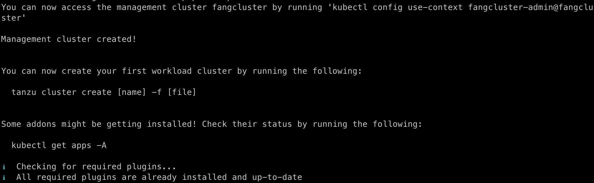
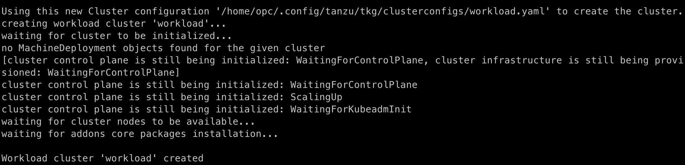

# Oracle Support MVP

## Table of Contents

- [Oracle Support MVP](#oracle-support-mvp)
  - [Table of Contents](#table-of-contents)
  - [Environment Setup](#environment-setup)
    - [Existing Network Infrastructure on Oracle Cloud](#existing-network-infrastructure-on-oracle-cloud)
    - [OCI Registry](#oci-registry)
    - [Host Machine that builds and runs Tanzu CLI](#host-machine-that-builds-and-runs-tanzu-cli)
      - [Build Tanzu CLI](#build-tanzu-cli)
      - [Prepare TKR as additional manifest](#prepare-tkr-as-additional-manifest)
  - [Management Cluster Creation on Oracle Cloud](#management-cluster-creation-on-oracle-cloud)
    - [Export Cluster Configurations as Environment Variables](#export-cluster-configurations-as-environment-variables)
    - [Fix Compatibility](#fix-compatibility)
    - [Provision Management Cluster](#provision-management-cluster)
  - [Workload Cluster Creation on Oracle Cloud](#workload-cluster-creation-on-oracle-cloud)

## Environment Setup

### Existing Network Infrastructure on Oracle Cloud

An Oracle Cloud account is required to provison network infrastructure that TKG runs on.

TKG on Oracle supports using existing network infrastructure to launch clusters. An example terraform module of such network infrastructure is [here](https://github.com/randomvariable/tkg-oci/tree/master/terraform/tkg-oci).

You can use terraform to provision those infrastructures on your Oracle compartment. Create an input to the et `sample.tfvars` from the following template. Change variables like `compartment_id`, `region` and `tenancy_id` to specify where the network infrastructure will be provisioned.

```terraform
compartment_id = "ocid1.compartment.oc1..aaaaaaaaxxxxxxxxxxxxxxxxxxxxxxxxxxxxxxxxxxxxxxxxxxxx"
region         = "us-sanjose-1"
home_region    = "us-phoenix-1"
ignore_defined_tags = [
  "Owner.Creator",
  "Oracle-Tags.CreatedBy",
  "Oracle-Tags.CreatedOn",
]

public_control_plane_endpoint = true
create_public_services_subnet = true
tenancy_id                    = "ocid1.tenancy.oc1..aaaaaaaaxxxxxxxxxxxxxxxxxxxxxxxxxxxxxxxxxxxxxxxxxxxx"
create_tags                   = false
create_dynamic_groups = false
```

Initialize and apply the terraform module with `terraform init && terraform apply -var-file=sample.tfvars`. The module will return the OCID of provisioned resources (VCN, subnets, security groups and the load balancer). Those OCIDs will be consumed in the [later section](#export-cluster-configurations-as-environment-variables).

```terraform
load_balancer_id = "ocid1.networkloadbalancer.oc1.us-sanjose-1.aaaaaaaaxxxxxxxxxxxxxxxxxxxxxxxxxxxxxxxxxxxxxxxxxxxx"
security_group_ids = {
  "control_plane" = "ocid1.networksecuritygroup.oc1.us-sanjose-1.aaaaaaaaxxxxxxxxxxxxxxxxxxxxxxxxxxxxxxxxxxxxxxxxxxxx"
  "control_plane_endpoint" = "ocid1.networksecuritygroup.oc1.us-sanjose-1.aaaaaaaaxxxxxxxxxxxxxxxxxxxxxxxxxxxxxxxxxxxxxxxxxxxx"
  "workers" = "ocid1.networksecuritygroup.oc1.us-sanjose-1.aaaaaaaaxxxxxxxxxxxxxxxxxxxxxxxxxxxxxxxxxxxxxxxxxxxx"
}
subnet_ids = {
  "compute" = "ocid1.subnet.oc1.us-sanjose-1.aaaaaaaaxxxxxxxxxxxxxxxxxxxxxxxxxxxxxxxxxxxxxxxxxxxx"
  "control-plane-endpoint" = "ocid1.subnet.oc1.us-sanjose-1.aaaaaaaaxxxxxxxxxxxxxxxxxxxxxxxxxxxxxxxxxxxxxxxxxxxx"
  "private-services" = "ocid1.subnet.oc1.us-sanjose-1.aaaaaaaaxxxxxxxxxxxxxxxxxxxxxxxxxxxxxxxxxxxxxxxxxxxx"
  "public-services" = "ocid1.subnet.oc1.us-sanjose-1.aaaaaaaaxxxxxxxxxxxxxxxxxxxxxxxxxxxxxxxxxxxxxxxxxxxx"
}
vcn_id = "ocid1.vcn.oc1.us-sanjose-1.aaaaaaaaxxxxxxxxxxxxxxxxxxxxxxxxxxxxxxxxxxxxxxxxxxxx"
```

### OCI Registry

An OCI Registry to store the built images as well as package bundles. We have already built a version set of images and packages at a public registry `gcr.io/tkg-on-oci`. *You may SKIP this step if using the registry we've built.*

Otherwise, follow the instructions below to setup your own registry.

Clone down the tanzu-framework repository and check out the [Oracle Support PR](https://github.com/vmware-tanzu/tanzu-framework/pull/3557).

Export environment variables as in this [section](#build-tanzu-cli).

Build and push images to the OCI registry.

```shell
make docker-build  && make docker-publish && make kbld-image-replace
```

Check `packages/standalone-plugins/kbld-config.yaml` and check all the newImage values are filled in. `telemetry-linux` and `telemetry-darwin` are currently missing, remove following two lines in the `packages/standalone-plugins/kbld-config.yaml` file.

```yaml
- image: tanzu-cli-plugins/telemetry-linux-amd64:latest
  newImage: ""
- image: tanzu-cli-plugins/telemetry-darwin-amd64:latest
  newImage: ""
```

Then we are ready to build and push the package bundles. The build requires a local registry.

```shell
make local-registry && make package-bundles && make push-all-package-bundles
```

Then build and push the package repo bundle

```shell
make package-repo-bundle PACKAGE_REPOSITORY=management
make push-package-repo-bundle PACKAGE_REPOSITORY=management
```

Check out the management repo you just pushed at `${OCI_REGISTRY}/management/management`. Ensure `OCI_REGISTRY` and `_MANAGEMENT_PACKAGE_REPO_IMAGE` reflects the URL of your OCI registry.

The rest part for this document assumes the registry URL is `gcr.io/tkg-on-oci`. Replace it with your registry URL.

### Host Machine that builds and runs Tanzu CLI

A virtual machine with at least 70 GB of disk space.

Install following prerequisites.

- git
- docker
- golang 1.17+
- kubectl
- kind
- [imgpkg CLI](https://carvel.dev/imgpkg/docs/v0.33.0/install/)
- has Oracle Cloud private key as `/home/opc/.oci/oci_api_key.pem`

#### Build Tanzu CLI

Clone down the tanzu-framework repository and check out the [Oracle Support PR](https://github.com/vmware-tanzu/tanzu-framework/pull/3557).

Export the following environment variables to specify build version (use the existed `v0.26.0-dev` on registry) and the management package bundle.

```shell
export DOCKER_BUILDKIT=1
export BUILD_VERSION=v0.26.0-dev
export OCI_REGISTRY=gcr.io/tkg-on-oci/tkg/management
export _MANAGEMENT_PACKAGE_REPO_IMAGE=gcr.io/tkg-on-oci/tkg/management/management:v0.26.0-dev
export _MANAGEMENT_PACKAGE_VERSION=v0.26.0-dev # should be identical with BUILD_VERSION
export TKG_CUSTOM_IMAGE_REPOSITORY=projects-stg.registry.vmware.com/tkg
export TKG_CUSTOM_COMPATIBILITY_IMAGE_PATH=v1.7.0-zshippable/tkg-compatibility
export PACKAGE_REPO_URL=gcr.io/tkg-on-oci/tkg/management/management:v0.26.0-dev
```

Build and install the Tanzu CLI using

```shell
rm -rf ~/.config/tanzu
cd tanzu-framework
make configure-bom
make generate-embedproviders
make build-install-cli-all-with-local-discovery # for the first time setup
make build-install-cli-local
```

After the Tanzu CLI is successfully built, add `~/go/bin/tanzu` to the $PATH.

Besides, turns on required feature gates with

```shell
tanzu config set features.cluster.auto-apply-generated-clusterclass-based-configuration true
tanzu config set features.global.package-based-lcm-beta true
```

#### Prepare TKR as additional manifest

Pull down the TKR using the tanzu subcommand. The subcommand will fetch the Oracle TKR from the registry and import the publish OSImage to your private registry.

```shell
tanzu cluster osimage oracle populate --tkr-path gcr.io/tkg-on-oci/tkg/tkr/tkr-oci:latest -d /tmp/tkr-oracle --compartment <your compartment>
```

Remove the `.imgpkg` directory.

```shell
rm -rf /tmp/tkr-oracle/.imgpkg
```

## Management Cluster Creation on Oracle Cloud

### Export Cluster Configurations as Environment Variables

Export Oracle Cloud Credentials as environment variables.

```shell
export OCI_TENANCY_ID=ocid1.tenancy.oc1..aaaaaaaaxxxxxxxxxxxxxxxxxxxxxxxxxxxxxxxxxxxxxxxxxxxx
export OCI_USER_ID=ocid1.user.oc1..aaaaaaaaxxxxxxxxxxxxxxxxxxxxxxxxxxxxxxxxxxxxxxxxxxxx
export OCI_CREDENTIALS_FINGERPRINT=eb:02:ee:4b:4c:8e:xx:xx:xx:55:df:54:00:db:be:0f
export OCI_REGION=us-sanjose-1
export OCI_COMPARTMENT_ID=ocid1.compartment.oc1..aaaaaaaaxxxxxxxxxxxxxxxxxxxxxxxxxxxxxxxxxxxxxxxxxxxx

# if Passphrase is not present
export OCI_TENANCY_ID_B64="$(echo -n "$OCI_TENANCY_ID" | base64 | tr -d '\n')"
export OCI_CREDENTIALS_FINGERPRINT_B64="$(echo -n "$OCI_CREDENTIALS_FINGERPRINT" | base64 | tr -d '\n')"
export OCI_USER_ID_B64="$(echo -n "$OCI_USER_ID" | base64 | tr -d '\n')"
export OCI_REGION_B64="$(echo -n "$OCI_REGION" | base64 | tr -d '\n')"
export OCI_CREDENTIALS_KEY_B64=$(base64 < /home/opc/.oci/oci_api_key.pem | tr -d '\n')
export OCI_SSH_KEY=$(cat /home/opc/.ssh/id_rsa.pub)
```

Additionally, expose Oracle cluster specific configurations. These OCIDs should comes from the [previous terraform output](#existing-network-infrastructure-on-oracle-cloud). See the comments for the actual mapping.

```shell
export OCI_NODE_PV_TRANSIT_ENCRYPTION=false
export OCI_CONTROL_PLANE_PV_TRANSIT_ENCRYPTION=false
export OCI_EXTERNAL_VCN_ID=ocid1.vcn.oc1.us-sanjose-1.aaaaaaaaxxxxxxxxxxxxxxxxxxxxxxxxxxxxxxxxxxxxxxxxxxxx # vcn_id

export OCI_PRIVATE_SERVICE_SUBNET_ID=ocid1.subnet.oc1.us-sanjose-1.aaaaaaaaxxxxxxxxxxxxxxxxxxxxxxxxxxxxxxxxxxxxxxxxxxxx # private-services

export OCI_EXTERNAL_CONTROL_PLANE_EP_NSG_ID=ocid1.networksecuritygroup.oc1.us-sanjose-1.aaaaaaaaxxxxxxxxxxxxxxxxxxxxxxxxxxxxxxxxxxxxxxxxxxxx # control_plane_endpoint
export OCI_EXTERNAL_CONTROL_PLANE_NSG_ID=ocid1.networksecuritygroup.oc1.us-sanjose-1.aaaaaaaaxxxxxxxxxxxxxxxxxxxxxxxxxxxxxxxxxxxxxxxxxxxx # control_plane
export OCI_EXTERNAL_WORKER_NSG_ID=ocid1.networksecuritygroup.oc1.us-sanjose-1.aaaaaaaaxxxxxxxxxxxxxxxxxxxxxxxxxxxxxxxxxxxxxxxxxxxx # workers

export OCI_EXTERNAL_CONTROL_PLANE_EP_SUBNET_ID=ocid1.subnet.oc1.us-sanjose-1.aaaaaaaaxxxxxxxxxxxxxxxxxxxxxxxxxxxxxxxxxxxxxxxxxxxx # control-plane-endpoint
export OCI_EXTERNAL_CONTROL_PLANE_SUBNET_ID=ocid1.subnet.oc1.us-sanjose-1.aaaaaaaaxxxxxxxxxxxxxxxxxxxxxxxxxxxxxxxxxxxxxxxxxxxx # compute
export OCI_EXTERNAL_WORKER_SUBNET_ID=ocid1.subnet.oc1.us-sanjose-1.aaaaaaaaxxxxxxxxxxxxxxxxxxxxxxxxxxxxxxxxxxxxxxxxxxxx # compute
```

### Fix Compatibility

The tanzu CLI will determine which version of TKG BOM to use according to the management plugin version. Their mapping is defined in `~/.config/tanzu/tkg/compatibility/tkg-compatibility.yaml` file. Since currently [CAPOCI](https://github.com/oracle/cluster-api-provider-oci) only exists in 1.7.0-zshippable BOM, we need to ensure the file named `tkg-compatibility.yaml` has following content.

```yaml
- version: v0.26.0-dev # should be identical with BUILD_VERSION
  supportedTKGBomVersions:
  - imagePath: tkg-bom
    tag: v1.7.0-zshippable
```

### Provision Management Cluster

Export TKG cluster related configurations as environment variables.

```shell
export CLUSTER_PLAN='devcc'
export CLUSTER_NAME='demo-cluster'
export PROVIDER_TYPE='oci'
export INFRASTRUCTURE_PROVIDER='oci'
```

Use the following command to provsion the management cluster. Notice that we are passing in TKR as additional manifests for now.
Put any additional configurations in `~/mc.yaml` or leave it blank otherwise.

```shell
tanzu management-cluster create -f ~/mc.yaml --additional-manifests ~/tkr-oci --additional-manifests-namespace tkg-system
```

Congrats! You have created the first TKG management cluster on the Oracle Cloud Infrastructure!



## Workload Cluster Creation on Oracle Cloud

Create a workload cluster called `workload` with same configurations as the management cluster, from previous environment variables. Put any additional configurations in `~/wc.yaml` or leave it blank otherwise.

```shell
export CLUSTER_NAME=workload
tanzu cluster create -f wc.yaml
```

Hoo-ray! You have created the first TKG workload cluster on  on the Oracle Cloud Infrastructure!


