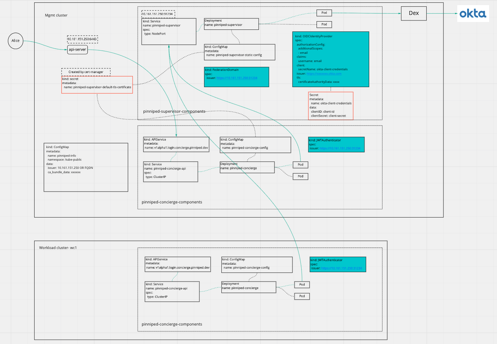

# Pinniped integration for TKG

## Introduction

The goal of integrating with Pinniped is to provide user authentication feature for TKG clusters. Pinniped allows cluster
administrators to easily plug in external identity providers (IDPs) into Kubernetes clusters. This is achieved via a
uniform install procedure across all types and origins of Kubernetes clusters, declarative configuration via Kubernetes
APIs, enterprise-grade integrations with IDPs, and distribution-specific integration strategies. Users could specify the
identity management source(OIDC/LDAP) during the cluster bootstrapping step and perform Day2 configurations based on
their needs.

[Official Pinniped documentation](https://pinniped.dev/docs/)

## Architecture

### Components on Management cluster

* Pinniped Supervisor
* Pinniped Concierge
* Dex
* Pinniped post deployment job

There are three CRs of Pinniped will be deployed:

* OIDCIdentityProvider
* FederationDomain
* JWTAuthenticator

And there is a ConfigMap called `pinniped-info` created under `kube-public` with cluster_name, issuer,
issuer_ca_bundle_data as its content.

#### Why having Dex deployed as part of Pinniped

Having Dex deployed as part of Pinniped is to support LDAP use cases since current release of Pinniped(v0.4.0) does not
have LDAP supported. Per design for TKG Calgary release, we actually use Dex for both OIDC and LDAP by configuring the
upstream identity provider of Pinniped to always be Dex and the static client of Dex always be Pinniped. We have the plan
to improve this flow by using Dex only for LDAP, and this will land post TKG Calgary release.

#### Why having Pinniped post deployment job

There are something we could not configure at the time of the deployment, e.g. service external IP/DNS for both Pinniped
and Dex. We need the post deployment job to configure those things to make the entire authentication work. It configures
the following:

* Update `Certificate` to have correct external IP/DNS for both Dex and Pinniped service.
* Update `OIDCIdentityProvider` to have correct issuer url and tls cert.
* Update `JWTAuthenticator` to have correct issuer url.
* Update `ConfigMap` of Dex to have correct configurations.
* Update `Secret` used by the communication between Dex and Pinniped.

There will be a new implementation of the post deployment job which will configure the `Pinniped Addon Secret` directly
instead of updating the K8S resources, so that the Addon-Manager will picks up the change and reconcile.

### Components on Workload clusters

* Pinniped Concierge

There are one CRs of Pinniped will be deployed:

* JWTAuthenticator

The JWTAuthenticator holds the issuer url pointing back to Pinniped Supervisor service, so that the workload cluster could
communicate back to management cluster to complete the whole authentication flow.

## How to enable TKG Pinniped addon at the cluster bootstrapping step

If you use TKG cli or Tanzu cli to bootstrap TKG clusters, then the installation wizard will guide you to fill in the required
configurations in order to deploy TKG Pinniped addon.

## How to enable TKG Pinniped addon to an existing cluster

**Note:** You could use this approach to deploy TKG Pinniped addon to any clusters, there is no need to install addon-manager
or kapp-controller to test out TKG Pinniped addon.

* Create the ytt value yaml(`values.yaml`) based on the example from [here](./examples), and substitute the values for
  your case.
* Run `ytt --ignore-unknown-comments -f ../ytt-common-libs -f ../pinniped/templates -f values.yaml > pinniped.yaml`
* Run `kubectl apply -f pinniped.yaml`. Once you have applied the `pinniped.yaml` you should be able to see required
  resources are creating. The post deploy job
  will also be running to configure the Pinniped and Dex installation to make all things work. Wait for a while until
  the post deploy job to complete.
  * If using external OIDC provider, you might want to configure the OIDC provider by providing correct login redirect
    url to Dex service.
* Copy the Pinniped-cli from [here](./post-deploy/hack/bin/pinniped-cli) or download from Pinniped [Github](https://github.com/vmware-tanzu/pinniped/releases)
* Run `./pinniped-cli get kubeconfig` to get the updated kubeconfig which could be distributed to authorized users. The
  users with that kubeconfig will be redirected to configured authentication page.

## How to use custom TLS Certificates

Pinniped and Dex use self-signed `Issuer` by default to generate the signed TLS certificates. Users can override the default
setting with the following two options.

### Using custom ClusterIssuer

If the user has an existing `ClusterIssuer` that can be used to sign certificates, the self-signed Issuer can be replaced
by specifying `custom_cluster_issuer` in values.yaml. User can put the name of the `ClusterIssuer` for this field, then
both Pinniped and Dex TLS certificates will be signed by this ClusterIssuer instead.

### Using custom TLS Secret

Users can also specify their own TLS secrets directly. This can only be configured as day 2 operation after Pinniped and
Dex are running successfully.

Users will need to create 2 separate `kubernetes.io/tls` secrets. Both secrets should have the same name. The first one
should be signed against the IP or DNS of Pinniped service and put in the namespace of Pinniped Supervisor. The second one
should be signed against IP or DNS of Dex service and put in the namespace of Dex.

Once the secrets are ready, add the secret name to `custom_tls_secret` in values.yaml and redeploy.

## Day 2 operations in TKG Calgary release

It is possible that you provided the incorrect configurations for your user authentication on Day 1 and you want to perform
Day 2 operations to reconfigure it.

The following settings are the configurable on Day 2:

* **OIDC client ID**: The client ID of upstream OIDC provider. To make the changes, update `dex.config.oidc.CLIENT_ID` in
  Pinniped addon `Secret` and restart Dex pods.
* **OIDC client secret**: The client secret of upstream OIDC provider. To make the changes, update `dex.config.oidc.CLIENT_SECRET`
  in Pinniped addon `Secret` and restart Dex pods.
* **OIDC issuer**: The upstream OIDC issuer url. To make the changes, update `dex.config.oidc.issuer` in
  Pinniped addon `Secret` and restart Dex pods.
* **OIDC scopes**: List of additional scopes to request in token response. To make the changes, update `dex.config.oidc.scopes` in
  Pinniped addon `Secret` and restart Dex pods.
* **OIDC claimMapping**: Some providers return non-standard claims (eg. mail). Use claimMapping to map those
  claims to standard claims. To make the changes, update `dex.config.oidc.scopes` in Pinniped addon `Secret` and restart
  Dex pods.
* **LDAP host**: Host and optional port of the LDAP server in the form "host:port". To make the changes, update
  `dex.config.ldap.host` in Pinniped addon `Secret` and restart Dex pods.
* **LDAP bindDN and bindPW**: The DN and password for an application service account. The connector uses these credentials
  to search for users and groups. Not required if the LDAP server provides access for anonymous auth. To make the changes,
  update `dex.config.ldap.bindDN` or `dex.config.ldap.bindPW` in Pinniped addon `Secret` and restart Dex pods.
* **LDAP userSearch**: User search maps a username and password entered by a user to a LDAP entry. To make the changes,
  update `dex.config.oidc.userSearch` in Pinniped addon `Secret` and restart Dex pods.
* **LDAP groupSearch**: Group search queries for groups given a user entry. To make the changes, update
  `dex.config.oidc.userSearch` in Pinniped addon `Secret` and restart Dex pods.

Above configurations are eventually loaded in Dex. More details on Dex configurations could be found here:

* [LDAP](https://dexidp.io/docs/connectors/ldap/)
* [OIDC](https://dexidp.io/docs/connectors/oidc/)

* **Custom cluster issuer**: The name of custom cluster issuer
  * Update the `custom_cluster_issuer` in Pinniped addon secret called `<clustername>-pinniped-addon`
  * Pinniped post deployment job will be triggered to perform the reconfiguration
* **Custom tls secret**: The name of the custom TLS secret
  * Update the `custom_tls_secret` in Pinniped addon secret called `<clustername>-pinniped-addon`
  * Pinniped post deployment job will be triggered to perform the reconfiguration

## Images

### Post deploy job images

* Latest development image: gcr.io/kubernetes-development-244305/gdaniel/tkg-pinniped-post-deploy:latest

### Pinniped addon template images

* Latest development image: gcr.io/kubernetes-development-244305/gdaniel/tkg-addons-pinniped-templates:latest

## Known issues and debug guidelines

### Manually updated fields are reverted

The kapp-controller under the hood will reconcile the `App` based on the configuration values from Pinniped addon `Secret`.
Only few fields are configured to be ignored by kapp-controller:

* `OIDCIdentityProvider.spec.authorizationConfig`
* `OIDCIdentityProvider.spec.claims`
* `OIDCIdentityProvider.spec.issuer`
* `OIDCIdentityProvider.spec.tls`
* `FederationDomain.spec.issuer`
* `JWTAuthenticator.spec.audience`
* `JWTAuthenticator.spec.claims`
* `JWTAuthenticator.spec.issuer`
* `JWTAuthenticator.spec.tls`
* Dex `ConfigMap`
* Dex TLS `Certificate`
* Pinniped TLS `Certificate`
* Pinniped client `Secret`

So any changes in other fields will be reverted to be what were provided in the Pinniped addon `Secret` after the sync
period. If you want to reconfigure anything other than above fields, please update the Pinnied addon `Secret` accordingly.

### The OIDC discovery failure from `OIDCIdentityProvider` CR status

* Check the `issuer` field to make sure it is configured properly, if not you could update the value directly in
  `OIDCIdentityProvider`.
* Check if the `tls` field has the correct certificate, the TLS certificate is the one used to talk to upstream IDP. In
  TKG Calgary release, the upstream of Pinniped is Dex.
* The `OIDCIdentityProvider` should be configured automatically by the post deployment job, if it is not configured properly
  check the log of post deployment job to see there are any errors

### Cannot authenticate from workload cluster

* Make sure the Pinniped supervisor service is accessible from workload cluster.
* Check the `JWTAuthenticator` CR to make sure the `issuer` field is configured properly. It should be configured to be
  the Pinniped supervisor service external IP/DNS. If the value is incorrect, you could update `JWTAuthenticator` CR directly.
* Check the `tls` field has the correct CA bundle data. The CA bundle is used for the communication between workload cluster
  and Pinniped supervisor service in management cluster.

### Post deployment job fails

* With error message "the LoadBalancer ingress is not ready": We saw this issue several times with TKG on Azure. The root
  cause of this issue is that either Pinniped supervisor service external IP or Dex service external IP is not ready when
  using `LoadBalancer` as the `Service.Spec.Type`. Try to run `kubectl delete app pinniped -n tkg-system`, wait for a while
  to let the addon-manager recreate the Pinniped addon, list the service to see if external IP address is assigned.
